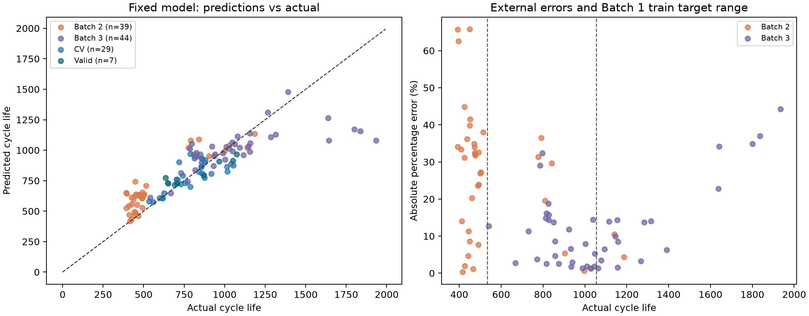

# ESS 배터리 초기 신호 기반 수명 예측

초기 100사이클의 충·방전 신호로 배터리 셀의 총수명(`cycle_life`)을 예측하는 회귀 프로젝트입니다. MIT–Stanford 배터리 데이터의 Batch 1·2·3을 분석하고, 피처 설계부터 모델 선택·외부 평가·오류 해석까지 수행했습니다.

## 주요 결과

선택 모델은 **ΔQ log 분산 하나를 사용하는 Ridge(alpha=0.1, 원 수명 타깃)**입니다. ΔQ는 동일 전압 축에서 계산한 `Q100(V) − Q10(V)`입니다. 전체 수명으로 계산한 knee·종료 용량·수명 라벨은 입력에서 제외했습니다.

| 평가 | MAPE (%) | 의미 |
| --- | ---: | --- |
| Batch 1 선택용 그룹 CV | 7.93 ± 1.88 | 후보 선택에 사용한 5-fold 평균 ± 표준편차 |
| Batch 1 중첩 그룹 CV | 15.35 ± 12.70 | 각 outer fold의 내부에서 후보 선택을 반복한 보조 검증 |
| Batch 1 Hold-out | 10.76 | 선택에 쓰지 않은 7셀 |
| Batch 2 | 25.69 | Batch 1의 36셀로 재학습 후 39셀 평가 |
| Batch 3 | 12.08 | 같은 모델로 44셀 추가 평가 |

Batch 2 MAPE는 학습 중앙값 기준 모델의 58.73%보다 낮지만, 논문 비교 기준 9.1%보다 **16.59%p 높습니다.** 데이터 구성과 라벨 정책이 달라 논문과 동일한 실험은 아닙니다. 실제 단수명(<500) 셀 28개 중 21개(75%)를 경고하지 못해 **ESS 단수명 선별·보증·안전 판단에 직접 사용할 수 없습니다.**



## 분석과 검증

- **DAY 1:** 수명 분포, 열화 곡선과 knee, ΔQ(V), 충전 조건, 초기 신호의 상관과 다중공선성을 배치별로 비교했습니다.
- **피처:** G0 ΔQ에 용량 기울기·충전시간·C-rate·온도를 단계적으로 추가하고, 초기 2~5사이클의 시간 가중 RMS 전류도 별도로 비교했습니다.
- **분할:** 라벨 품질 기준을 적용한 Batch 1의 36셀을 Train/CV 29셀·16정책 그룹과 Hold-out 7셀·4그룹으로 고정했습니다. 학습·검증 경계에서 정책 그룹은 겹치지 않습니다.
- **학습:** 결측 대체·표준화는 각 학습 fold에서만 적합했습니다. Ridge, ElasticNet, 작은 Random Forest, Gradient Boosting과 원·로그 타깃을 비교했습니다.
- **검증:** 중첩 CV, 같은 모델에서의 피처 비교, 외부 중앙값 기준 비교, 입력·정책 분포 차이, 라벨 제외 영향, 단수명 위험을 확인했습니다. 저장 모델과 재학습 결과의 일치도도 테스트합니다.

Train 표본이 작아 후보 선택이 불안정합니다. DAY 1에서 외부 배치의 분포와 라벨을 관찰했으므로 완전한 눈가림 시험은 아닙니다. 보완 분석은 기존 모델을 고정한 상태에서 수행했으며, 새로운 독립 시험 데이터는 확보하지 못했습니다.

## 결과 살펴보기

| 자료 | 내용 |
| --- | --- |
| [01_EDA.ipynb](notebooks/01_EDA.ipynb) | 세 배치 EDA와 DAY 1 모델 전략 |
| [02_feature_engineering.ipynb](notebooks/02_feature_engineering.ipynb) | 초기 피처 후보·입력 제한·피처 추가 효과 |
| [03_modeling.ipynb](notebooks/03_modeling.ipynb) | 학습·평가·중첩 검증·오류 분석·저장 모델 예측 |
| [DAY 1 모델 설계 PDF](report/DAY1_모델설계.pdf) | 12쪽 설계 보고서 |
| [DAY 1 상세 근거](report/DAY1_모델전략_상세.md) | 질문별 통계와 모델 전략의 근거 |
| [DAY 2 모델 평가 보고서](report/DAY2_모델평가.md) | 성능·Gap·배치 차이·적용 한계 |
| [성능 요약 CSV](results/model_performance.csv) | 제출 형식의 성능표 |
| [결과 파일 안내](results/README.md) | 상세 CSV·모델·그림의 용도 |

## 프로젝트 구조

```text
├── data/
│   ├── README.md
│   ├── raw/                         # 원본 MAT 저장 위치; Git 제외
│   └── processed/                   # 재현에 필요한 가공 데이터와 고정 분할
├── notebooks/
│   ├── 01_EDA.ipynb
│   ├── 02_feature_engineering.ipynb
│   └── 03_modeling.ipynb
├── src/
│   ├── preprocess.py                # 데이터 결합·고정 분할 검증
│   ├── features.py                  # 초기 피처 묶음·입력 제한
│   ├── train.py                     # 학습·평가·보고서 생성
│   ├── evaluation.py                # 중첩 CV·피처 비교·배치 및 위험 진단
│   ├── predict.py                   # 저장 모델로 새 셀 예측
│   └── ...                          # DAY 1 추출·분석·보고서·원본 대조 코드
├── results/                         # 성능표·예측·검증 근거·저장 모델
├── report/                          # DAY 1·2 보고서와 PDF 원고
├── tests/                           # 입력 누수·분할·성능·예측 검증
├── requirements.txt
└── README.md
```

## 실행 방법

Python **3.12**를 사용합니다. 프로젝트 루트에서 실행하세요.

```bash
python3.12 -m venv .venv
source .venv/bin/activate
python -m pip install -r requirements.txt
python -m ipykernel install --user --name ess-day1 --display-name "ESS DAY1"
```

Windows의 활성화 명령은 `.venv\Scripts\activate`입니다. VS Code에서 **ESS DAY1** 커널을 선택하고 노트북을 01 → 02 → 03 순서로 실행합니다. 저장된 `data/processed/`가 있어 대용량 원본 없이도 실행할 수 있습니다.

```bash
# DAY 2 학습·추가 검증·보고서·저장 모델 재생성
python src/train.py --root .
# 검증 테스트 14개
python -m unittest discover -s tests
# 새 셀의 초기 피처로 총수명 예측
python src/predict.py --root . --input new_cell_features.csv --output results/new_predictions.csv
```

새 CSV에는 초기 100사이클까지의 측정으로 계산한 `log_var_delta_q`가 필요하며 `cell_id`를 선택적으로 포함할 수 있습니다. 출력 `predicted_cycle_life`는 총수명입니다. 입력·학습 셀·패키지 버전은 [모델 manifest](results/day2_model_manifest.json)에 기록돼 있습니다.

원본 다운로드·전처리·독립 대조 방법은 [데이터 안내](data/README.md)에 있습니다. DAY 1 보고서와 노트북 템플릿은 `python src/build_deliverables.py`로 생성합니다. 이 명령은 노트북을 다시 쓰므로 실행 결과를 재저장해야 합니다. PDF 재생성 시에는 `src/detailed_day1.py`의 `FONT`를 설치된 한글 TTF 경로로 설정하세요.

## 참고 자료

- [실습 가이드](https://actually-war-1ea.notion.site/DS-Mini-Project-32d7f4c8669380338a27f90c471c1fcb)
- [Kaggle 데이터셋](https://www.kaggle.com/datasets/itshpark/data-driven-prediction-of-battery-cycle)
- [연구진 공개 로더](https://github.com/rdbraatz/data-driven-prediction-of-battery-cycle-life-before-capacity-degradation)
- [Severson et al. (2019)](https://www.nature.com/articles/s41560-019-0356-8)
