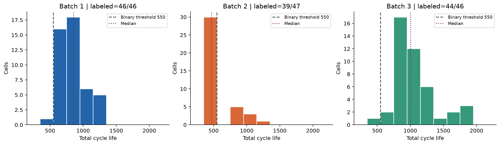
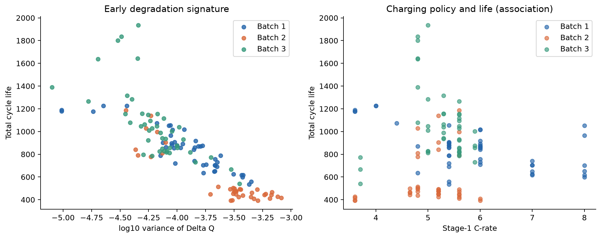

# ESS 배터리 초기 신호 기반 수명 예측

배터리의 초기 충·방전 데이터에서 열화 신호를 찾고, 이를 이용해 총수명을 예측하는 데이터 분석 프로젝트입니다. MIT–Stanford 배터리 실험 데이터의 세 배치를 탐색하여 수명과 관련된 피처를 선정하고, ESS 셀 선별과 교체 우선순위 판단에 활용할 수 있는 회귀 모델을 설계합니다.

DAY 1의 EDA·모델 설계와 DAY 2의 모델 개발·외부 배치 평가를 완료했습니다. 핵심 ΔQ 변수 하나를 사용한 Ridge 회귀가 Batch 1 교차검증에서 선택됐습니다. **Batch 2 MAPE는 25.69%로 원논문 비교 기준 9.1%보다 높습니다.** 이 배치 차이를 주요 결과와 한계로 보고합니다.

## 1. 프로젝트 목표

- 초기 100사이클의 측정값으로 총수명 `cycle_life`를 예측합니다.
- 방전용량 변화, 충전 조건, 온도, 내부저항 중 수명과 관련된 신호를 탐색합니다.
- 배치별 분포 차이와 데이터 품질을 확인하여 검증 전략을 수립합니다.

타깃은 공칭 용량의 80%에 도달할 때까지의 **총 사이클 수**입니다. 특정 시점에서의 잔여수명(RUL)과 구분합니다. 회귀의 주 평가 지표는 MAPE(%), 보조 지표는 MAE와 RMSE입니다.

## 2. 데이터셋

[MIT–Stanford 배터리 실험 데이터의 Kaggle 배포본](https://www.kaggle.com/datasets/itshpark/data-driven-prediction-of-battery-cycle)을 사용합니다. 각 셀에는 수명 라벨, 충전 정책, 사이클별 요약 측정값과 사이클 내부의 전압·전류·온도·용량 곡선이 포함되어 있습니다.

| 배치 | 원본 파일 날짜 | 전체 셀 | 유효 수명 라벨 | 수명 중앙값¹ | 모델링 용도 |
|---|---|---:|---:|---:|---|
| Batch 1 | 2017-05-12 | 46 | 46 | 858.5 | 학습 및 내부 검증 |
| Batch 2 | 2018-02-20 | 47 | 39 | 472.0 | 최종 외부 평가 |
| Batch 3 | 2018-04-12 | 46 | 44 | 1005.5 | 추가 외부 평가 |
| 합계 | — | **139** | **129** | — | |

¹ 단위: 사이클. 중앙값은 수명 라벨이 있는 셀을 기준으로 계산했습니다. 결측 라벨 10개는 임의로 채우지 않았습니다.

## 3. 분석 내용과 주요 결과

### 수명 분포와 열화 곡선

배치별 수명 분포, 장수명(>1,000사이클)·단수명(<500사이클) 비율, 방전용량 감소와 가속 열화 구간을 비교했습니다. Batch 2의 수명 중앙값은 Batch 1·3보다 낮아, 배치 간 분포 차이를 고려한 평가가 필요합니다.



전체 수명 곡선에서 구한 knee는 탐색적 전환점 후보입니다. 27개 탐지 설정의 민감도를 비교해 131/139셀에서 모두 탐지되는 것을 확인했습니다. 위치의 작은 차이는 탐색 격자 해상도(기록 길이의 1%)에 제한됩니다. 예측 시점 이후의 정보를 포함하므로 모델 입력으로 사용하지 않습니다.

### 초기 방전곡선 변화 ΔQ(V)

동일 전압 축으로 보간된 방전용량 `Qdlin`을 이용해 다음 변화량을 계산했습니다.

```text
ΔQ(V) = Q100(V) − Q10(V)
```

Batch 1에서 ΔQ의 log10 분산과 수명의 Spearman 상관계수는 **−0.871(n=46)**입니다. 종료 용량 기준으로 수명 완료가 불확실한 셀을 제외해도 **−0.826(n=36)**으로 유지되어, 초기 피처 후보로 선정했습니다. ΔQ log 분산 하나를 핵심 기본형으로 두고 용량 기울기·충전시간·C-rate·평균 온도와 시간 가중 RMS 전류의 추가 효과를 동일한 Batch 1 교차검증에서 비교했습니다. 이는 탐색적 상관 결과이며 예측 모델의 성능을 뜻하지 않습니다.



### 충전 조건과 다중공선성

충전 정책을 단계별 C-rate와 전환 SOC로 분해하고, 실측 전류·충전시간·온도·내부저항과 수명의 관계를 비교했습니다. Batch 1에서 평균 Tavg와 Tmax의 Spearman 상관은 약 **0.95**로, 온도 변수 간 중복 신호가 큽니다. 충전 조건과 수명의 관계는 배치에 따라 달라지며, 상관만으로 인과 효과를 판단하지 않습니다.

### 데이터 품질

종료 시 유효 용량이 0.885 Ah를 초과하거나 제공되지 않은 셀 16개를 수명 완료 불확실로 표시했습니다. 결측 수명 라벨 목록과 일부 겹치므로 두 수를 합산해 제외 셀 수로 해석하지 않습니다. 주 분석에서는 해당 완료 불확실 셀을 제외하며, Batch 1 전체 46셀의 민감도 분석은 별도로 보고합니다. 라벨 정책은 고정한 분할 계획에 명시했습니다.

## 4. 피처 및 모델 설계

| 피처 후보 | 분석 근거 |
|---|---|
| ΔQ의 log10 분산·최솟값·평균 | 초기 방전곡선 변화와 수명의 관계 |
| 초기 방전용량 평균·표준편차, 10~100사이클 기울기 | 초기 용량 수준과 열화 추세 |
| 초기 온도·내부저항 및 저항 변화량 | 열적 조건과 셀 상태 |
| 충전시간·실측 양의 전류 | 실제 충전 조건 |
| 1·2단계 C-rate와 전환 SOC | 충전 프로토콜의 수치 표현 |

Batch 1에서 550사이클 미만 셀은 1개뿐이므로 해당 기준의 분류 검증은 불안정합니다. 연속적인 수명 차이를 활용하고 초기 100사이클의 ΔQ 신호를 반영하기 위해 회귀를 선택했습니다.

중앙값 기준 모델과 Ridge/ElasticNet, Random Forest, 얕은 Gradient Boosting을 같은 정책 그룹 CV에서 비교했습니다. 선택 모델은 **G0 ΔQ log 분산 하나를 입력으로 사용하는 Ridge(alpha=0.1, 원 수명 타깃)**입니다. 작은 셀 표본과 추가 변수의 불안정한 CV 성능 때문에 가장 단순한 피처 집합이 선택됐습니다.

### 검증 설계와 실행

1. 라벨이 유효하고 종료 용량 ≤0.885 Ah인 셀을 주 분석 대상으로 고정했습니다. Batch 1의 36셀·20정책 그룹을 학습 29셀·16그룹과 Hold-out 7셀·4그룹으로 분리했습니다(seed=42). 학습 부분에서 정책 그룹이 겹치지 않는 5-fold CV를 사용했습니다. 분할을 DAY 1에 고정한 뒤 DAY 2에서 그대로 사용했습니다.
2. 결측 대체·스케일링을 각 학습 fold에서만 적합하고, 정해진 G0~G4와 제한된 모델 후보를 CV 평균 MAPE로 비교했습니다.
3. 선택 모델을 Hold-out 7셀에서 1회 평가한 뒤 Batch 1의 36셀로 재학습해 Batch 2와 Batch 3에 적용했습니다. 외부 결과로 모델을 다시 선택하거나 튜닝하지 않았습니다.
4. MAPE·MAE·RMSE와 수명 구간별 오차를 확인했습니다. MAPE 차이는 `Valid−CV`, `Test−Valid`로 정의하며 단위는 퍼센트포인트(%p)입니다.

DAY 1 EDA에서 세 배치의 수명 라벨과 분포를 이미 관찰했으므로 외부 평가는 완전히 눈가림한 테스트가 아닙니다. 원논문의 MAPE 9.1%는 비교 기준이고, 본 프로젝트의 Batch 2 MAPE는 25.69%입니다.

### DAY 2 성능 결과

| 구분 | MAPE (%) | 해석 |
|---|---:|---|
| 중앙값 기준 모델, Batch 1 CV | 17.08 | 비교 기준 |
| Train, Batch 1 정책 그룹 5-fold CV | 7.93 ± 1.88 | 검증 fold 평균 ± 표준편차 |
| Valid, Batch 1 Hold-out 7셀 | 10.76 | 사양 선택 후 1회 평가 |
| Test, Batch 2 39셀 | 25.69 | 필수 외부 평가 |
| Gap, Valid−CV | +2.83 %p | 내부 검증 악화 |
| Gap, Test−Valid | +14.93 %p | 외부 배치 성능 저하 |
| Gap, Test−논문 9.1% | +16.59 %p | 데이터·라벨 정책이 달라 직접 동일 실험은 아님 |
| Test, Batch 3 44셀 | 12.08 | 선택 변경 없이 추가 평가 |

Batch 2에서 실제 수명이 학습 29셀의 범위인 534~1054사이클보다 짧은 셀은 30/39개입니다. 이 30셀의 MAPE는 28.76%이고, 평균적으로 수명을 **129사이클 과대 예측**했습니다. 반면 Batch 3에서는 학습 수명 상한보다 긴 17셀을 평균적으로 231사이클 과소 예측했습니다. 핵심 ΔQ 입력이 Batch 1 학습 범위 안에 있는 Batch 2의 21셀에서도 MAPE가 35.71%여서, 단순한 입력 외삽만으로 설명할 수 없습니다. 이 결과는 배치와 수명 구간이 바뀔 때 예측의 편향이 달라짐을 보여줍니다. 실제 ESS 선별에 적용하기 전에 더 다양한 운전 조건과 짧은 수명 셀을 추가로 검증해야 합니다.

[DAY 2 실행 노트북](notebooks/03_modeling.ipynb)과 [모델 평가 보고서](report/DAY2_모델평가.md)에 후보 비교, 고정 분할, 오류 상위 셀, ESS 해석과 한계를 수록했습니다. 제출용 성능표는 [`results/model_performance.csv`](results/model_performance.csv), 후보별·셀별 상세 수치는 `results/day2_*.csv`에서 확인할 수 있습니다.

### 추가 검증으로 확인한 신뢰성과 적용 범위

후보 선택을 내부 분할에서 반복한 **중첩 정책 그룹 CV는 15.35 ± 12.70%**였습니다. 기존 7.93%는 후보 선택에 사용한 CV 점수이며, 중첩 결과는 작은 표본에서 선택이 불안정함을 보여줍니다. 5개 outer fold 중 4개는 G0를 선택했고, G3가 선택된 한 fold는 MAPE 36.74%로 실패했습니다. DAY 1 피처 탐색까지 중첩한 것은 아니므로 독립 외부 시험을 대신하지 않습니다.

동일한 Ridge 설정에서 G0~G4 입력만 바꾼 결과, G1~G3는 G0보다 평균 CV MAPE가 악화했고 G4는 5개 fold 중 2개에서만 개선했습니다. Batch 2에서 모델은 학습 중앙값 기준 MAPE 58.73%를 25.69%로 낮췄지만, 실제 단수명(<500) 셀 28개 중 21개(75%)를 경고하지 못했습니다. **현재 모델은 ESS 단수명 선별·보증·안전 판단에 직접 사용할 수 없습니다.**

추가 분석은 기존 모델을 고정한 상태에서 수행했습니다. 입력 분포 차이, 기존/신규 충전정책, 라벨 제외 기준, Hold-out 포함 재학습의 영향과 후속 실험 조건은 [DAY 2 보고서](report/DAY2_모델평가.md)의 7~10절에 있습니다. 새로운 독립 시험 데이터는 확보하지 못했습니다.

## 5. 프로젝트 구조

```text
.
├── README.md
├── requirements.txt
├── notebooks/
│   ├── 01_EDA.ipynb              # 실행 결과와 해석이 포함된 EDA
│   ├── 02_feature_engineering.ipynb # 초기 피처 후보와 누수 점검
│   └── 03_modeling.ipynb         # DAY 2 학습, 평가, 오류 분석
├── data/
│   ├── README.md                # 원본·가공 데이터 안내
│   ├── raw/                     # 원본 MAT 저장 위치
│   └── processed/               # 셀 피처, 사이클 요약, 전압별 곡선
├── src/
│   ├── preprocess.py            # 가공 데이터 결합·고정 분할 검증
│   ├── features.py              # 초기 피처 묶음·화이트리스트
│   ├── train.py                 # 고정 분할 CV, 모델 학습·외부 평가
│   ├── evaluation.py            # 중첩 검증·피처 비교·위험 및 배치 진단
│   ├── predict.py               # 저장 모델로 초기 피처 CSV 예측
│   ├── eda.py                   # 원본 로딩·피처 계산·시각화
│   ├── build_deliverables.py     # 보고서·노트북 생성
│   ├── detailed_day1.py          # 질문별 추가 통계·상세 모델 전략 보고서
│   ├── strategy_checks.py       # Knee 민감도·초기 전류·고정 분할·입력 제한
│   ├── review_day1.py            # 원본과 분석 결과의 독립 대조
├── results/                     # model_performance.csv 및 분석 결과
└── report/
    ├── DAY2_모델평가.md          # 성능표·오류 분석·ESS 해석
    ├── DAY1_모델설계.pdf        # 12쪽 제출본
    ├── DAY1_모델전략_압축.md    # 제출본 원고
    └── DAY1_모델전략_상세.md    # 상세 분석 근거
```

- [분석 노트북](notebooks/01_EDA.ipynb)
- [피처 설계 노트북](notebooks/02_feature_engineering.ipynb)
- [모델링 노트북](notebooks/03_modeling.ipynb)
- [DAY 2 모델 평가 보고서](report/DAY2_모델평가.md)
- [모델 설계 보고서](report/DAY1_모델설계.pdf)
- [압축 제출본 원고](report/DAY1_모델전략_압축.md)
- [상세 모델 전략 원고](report/DAY1_모델전략_상세.md)

## 6. 실행 방법

Python **3.12**를 사용했습니다. 이 README가 있는 프로젝트 폴더에서 환경을 구성합니다.

```bash
python3.12 -m venv .venv
source .venv/bin/activate
python -m pip install -r requirements.txt
python -m ipykernel install --user --name ess-day1 --display-name "ESS DAY1"
```

Windows에서는 가상환경 활성화 명령을 `.venv\Scripts\activate`로 변경합니다. VS Code 또는 Jupyter에서 노트북을 열고 **ESS DAY1** 커널을 선택한 뒤 전체 셀을 실행합니다. DAY 2 전체 결과는 프로젝트 루트에서 `python src/train.py --root .`로 재생성할 수도 있습니다.

### 저장 모델로 새 셀 예측

`python src/train.py --root .`는 중첩 검증·진단 보고서와 함께 `results/day2_model.joblib` 및 입력·학습 셀·패키지 버전을 기록한 manifest를 생성합니다. 새 CSV는 초기 100사이클까지의 측정으로 계산한 `log_var_delta_q`를 포함해야 합니다. 선택적으로 `cell_id`를 넣을 수 있습니다.

```bash
python src/predict.py --root . --input new_cell_features.csv --output results/new_predictions.csv
```

결과는 총수명 예측(`predicted_cycle_life`)이며 100사이클 이후의 잔여수명과는 다릅니다. 학습에 사용한 환경과 다른 운전 조건에서는 별도 검증이 필요합니다.

### 가공 데이터로 실행

기본값 `REBUILD=False`는 `data/processed/`의 CSV·NPZ를 사용합니다. 이 파일들이 있으면 대용량 원본을 내려받지 않고 EDA를 재실행할 수 있습니다.

### 원본 데이터부터 실행

Kaggle에서 아래 세 파일을 다운로드하여 `data/raw/`에 저장합니다.

```text
2017-05-12_batchdata_updated_struct_errorcorrect.mat
2018-02-20_batchdata_updated_struct_errorcorrect.mat
2018-04-12_batchdata_updated_struct_errorcorrect.mat
```

노트북에서 `REBUILD=True`로 설정하거나 아래 명령을 실행합니다.

```bash
python src/eda.py --root .
```

원본과 저장된 결과를 독립적으로 대조하려면 다음 명령을 사용합니다.

```bash
python src/review_day1.py
```

보고서와 노트북 템플릿은 `python src/build_deliverables.py`로 재생성합니다. 보고서 생성에는 macOS AppleGothic을 사용하므로 다른 운영체제에서는 `src/detailed_day1.py`의 `FONT`를 사용 가능한 한글 TTF 경로로 변경해야 합니다. 이 명령은 노트북도 새로 생성하므로 실행 출력을 다시 저장해야 합니다.

## 7. 분석 기준과 적용 한계

- 원본 사이클 요약 CSV는 측정값을 보존합니다. 피처 계산에서는 용량 ≤0 또는 >1.32 Ah, IR ≤0, 온도 ≤0 또는 >100°C, 충전시간 ≤0을 결측 처리합니다. 정상적인 말기 용량 감소를 일괄 제거하지 않습니다.
- `eol_not_observed`는 종료 용량 기준의 완료 불확실 플래그이며, `eol_below_088_observed`는 실제 0.88 Ah 미만 관측 여부입니다. 기준 통과만으로 수명 라벨의 신뢰성이 확정되는 것은 아닙니다.
- 전압 축은 실제 `Vdlin`의 3.5→2.0 V를 사용했습니다. 이번 Batch 2 파일은 연구진 공개 로더의 2017-06-30 파일과 달라, 연구진의 셀 병합·제외 인덱스를 그대로 적용하지 않았습니다.
- 연구용 셀의 실험 조건과 실제 ESS 운전 조건은 다를 수 있습니다. 실제 교체 의사결정에 적용하려면 운전 조건 변화, 캘린더 열화와 예측 불확실성을 추가로 검증해야 합니다.

## 8. 참고 자료

- [미니 프로젝트 실습 가이드](https://actually-war-1ea.notion.site/DS-Mini-Project-32d7f4c8669380338a27f90c471c1fcb)
- [Kaggle 데이터셋](https://www.kaggle.com/datasets/itshpark/data-driven-prediction-of-battery-cycle)
- [연구진 공개 데이터 로더](https://github.com/rdbraatz/data-driven-prediction-of-battery-cycle-life-before-capacity-degradation)
- [Severson et al. (2019), Data-driven prediction of battery cycle life before capacity degradation](https://www.nature.com/articles/s41560-019-0356-8)

### 커널과 패키지 확인

노트북 마지막 셀은 현재 커널의 Python 경로와 패키지 버전을 표시합니다. 미설치 패키지는 `미설치`로 표시하며 셀 실행을 중단하지 않습니다. 필요한 패키지는 노트북에서 `%pip install nbformat nbclient`처럼 설치하면 현재 커널에 적용됩니다. 권장 재현 환경은 위의 Python 3.12 / ESS DAY1 커널입니다.

## 9. 추가 검증과 재현

- 전체 139셀에서 공통 cycle 2~5의 시간 가중 전류 평균·RMS·95분위·4 A 초과 시간 비율을 계산했습니다. Batch 1의 cycle 1에는 유효 충전 구간이 없어 공통 창을 사용했습니다. 새 입력은 `data/processed/early_current_features.csv`입니다.
- Knee 평활화 7/11/21 × 개선율 10/20/30% × 기울기 비율 1.2/1.5/2.0의 27설정 결과를 `results/knee_sensitivity_grid.csv`에 저장했습니다.
- 셀별 Hold-out/CV 배정은 `data/processed/batch1_split_plan.csv`, 라벨 정책과 초기 입력 화이트리스트는 `data/processed/modeling_plan.json`에 저장했습니다. 이 파일의 `models_trained: false`는 DAY 1에 고정한 설계 시점의 기록이며, DAY 2 학습 결과는 `results/day2_selected_model.json`과 성능 CSV에 저장했습니다. 모든 분할의 정책 그룹 중복은 0입니다.
- Hold-out 7셀·CV fold 5~6셀의 작은 표본, 종료 기준에 의한 모집단 선택, 사전에 관찰한 EDA로 인해 평가에는 한계가 있습니다. DAY 2 보고서에 오차와 정책군 부트스트랩 구간을 제시했습니다.

```bash
# 저장된 초기 전류 피처로 추가 분석 재실행
python src/strategy_checks.py
# 원본의 공통 초기 사이클에서 전류 피처 재추출
python src/strategy_checks.py --raw-dir data/raw
# 시간 가중·입력 누수·그룹 분리·중첩 CV·저장 모델 검증 (14개)
python -m unittest discover -s tests
```

### 관측 범위와 상관 불확실성

전체 Batch 1 EDA는 46셀·534~1227사이클, 라벨 품질 적용 후는 36셀·534~1074사이클이며, 최종 Train/CV는 29셀·534~1054사이클입니다. 외부 타깃 구간별 오차는 최종 Train을 기준으로 해석합니다(`results/target_range_by_cohort.csv`, `external_target_coverage.csv`).

기존 `early_positive_current`는 1~5사이클 중 유효 사이클의 샘플 중앙값 평균이고, 새 `charge_*`는 공통 2~5사이클의 시간 가중 피처입니다. Knee의 27설정은 3개 평활화별 위치 fit에 9개 채택 규칙을 적용한 조합이며 독립적인 27개 위치 추정이 아닙니다.

핵심 ΔQ와 RMS의 상관 구간은 정책군 단위 2,000회 부트스트랩으로 계산했습니다(`results/correlation_uncertainty.csv`). ΔQ의 구간은 세 배치 모두 음수이고 RMS는 Batch 2·3에서 0을 포함합니다. 작은 정책군 수와 교환가능성 가정에 의존하는 탐색 구간이며 인과관계·새 배치 일반화·모델 성능을 입증하지 않습니다.

## 10. 작업 범위

- 윤도균: Batch 1·2·3 EDA, 피처 추출, 고정 분할 설계, 회귀 모델 구현, 내부·외부 평가와 오류 분석.

이 저장소에는 DAY 1 보고서, DAY 2 실행 노트북, 모델링 코드와 성능 산출물이 포함됩니다.
