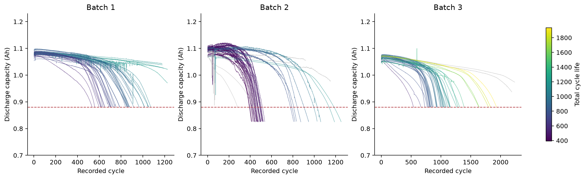
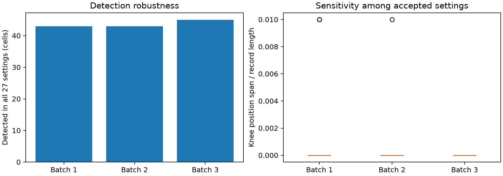
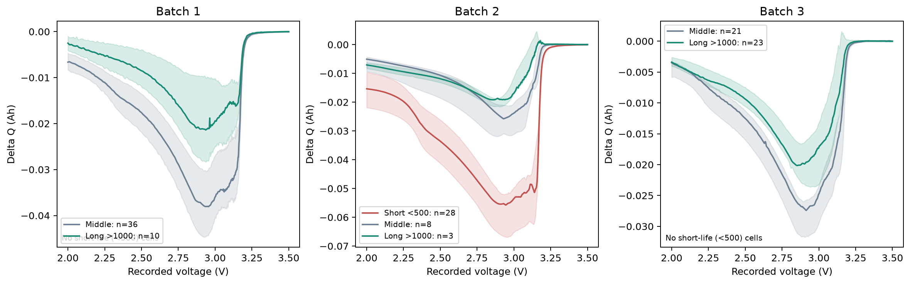
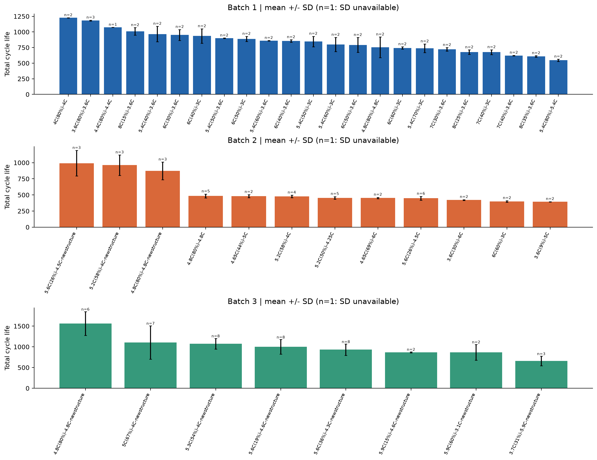
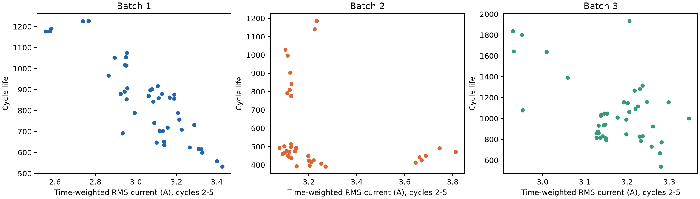
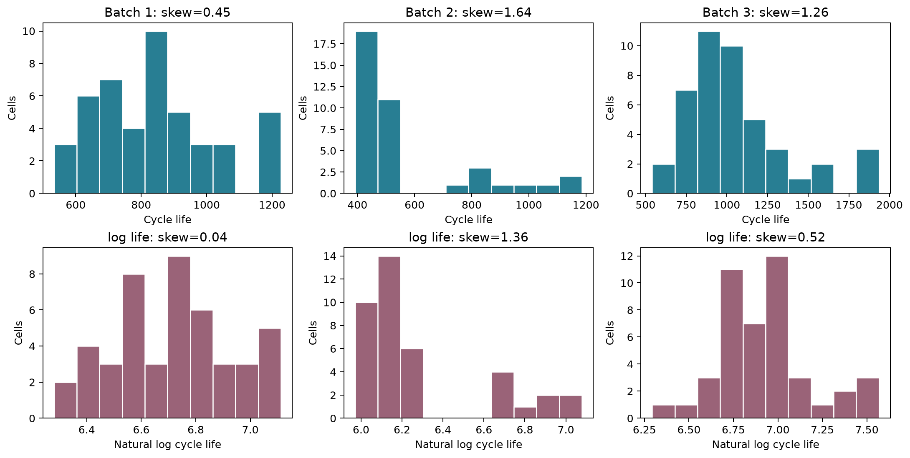

## 분석 목적과 데이터 품질

### 제출자

울산캠퍼스 4반 | 윤도균

### DAY 1 분석 목적

처음 100사이클에서 확보할 수 있는 신호로 배터리 셀의 총수명을 예측하는 회귀 전략을 수립한다. 세 배치의 EDA를 통해 핵심 신호, 배치 차이, 라벨 신뢰성과 모델 복잡도의 한계를 확인했다. 모델 학습·성능 평가는 이번 보고서의 범위가 아니다.

| 정의 | 본 프로젝트의 선택 |
| --- | --- |
| 분석 단위 | 배터리 셀 1개 = 모델 표본 1개. 116,722개 사이클 행을 독립 표본으로 취급하지 않는다. |
| X: 예측 시점의 입력 | 초기 100사이클까지의 방전곡선 변화, 용량 추세, 충전 조건, 온도·저항 |
| Y: Target | 원본 cycle_life: SOH 80%에 해당하는 총수명(사이클). 100사이클 시점 RUL과 구분. |
| 핵심 선택 | ΔQ log 분산으로 작은 기본 모델을 시작하고, 용량 기울기·충전시간·C-rate·온도를 단계적으로 추가한다. |
| 검증 원칙 | Batch 1 내부 CV·Hold-out으로 선택. Batch 2 필수 외부 평가, Batch 3 추가 평가. |

### 한눈에 보는 핵심 발견

전체 139개 셀 중 수명 라벨은 129개다. ΔQ log 분산과 수명의 상관은 Batch 1/2/3에서 -0.871/-0.709/-0.797로 방향이 일관된다. 충전시간과 초기 용량 기울기는 배치별 방향이 달라 조건 의존성이 크다. 따라서 모든 후보를 한 번에 넣는 전략을 피한다.

| 배치 | 전체 / 라벨 | 결측 라벨 | 완료 불확실 | 파일 날짜 |
| --- | --- | --- | --- | --- |
| Batch 1 | 46 / 46 | 0 | 10 | 2017-05-12 |
| Batch 2 | 47 / 39 | 8 | 4 | 2018-02-20 |
| Batch 3 | 46 / 44 | 2 | 2 | 2018-04-12 |

### 수집·처리

Kaggle 지정 MAT의 셀·summary·cycles를 실제 사이클 번호로 연결했다. 피처 계산에서 용량 ≤0 또는 >1.32 Ah, IR ≤0, 온도 ≤0 또는 >100°C, 충전시간 ≤0은 결측 처리하고 원본 summary는 보존했다. 결측 라벨 10개와 완료 불확실 16개는 겹치므로 합산하지 않는다.

### 라벨 신뢰성과 출처

Batch 1·3의 유효 라벨은 마지막 기록+1, Batch 2는 최초 QD<0.88 Ah 사이클이다. 종료 QD>0.885 Ah 또는 미제공은 완료 불확실로 표시했다. 실습 Batch 2(2018-02-20)는 연구진 공개 로더(2017-06-30)와 달라 병합·제외 인덱스를 그대로 적용하지 않았다.

## Q1. 수명 분포와 배치 간 차이

### 탐색 목적

학습 범위와 외부 평가 범위가 얼마나 다른지 확인하고, 짧은 수명이 일부 오류인지 일반적인 배치 특성인지 구분한다. 150~2,300사이클의 같은 축으로 비교한다.

| 배치 | 중앙값 / 평균 | 범위 | <500 | >1000 |
| --- | --- | --- | --- | --- |
| Batch 1 | 858.5 / 844.7 | 534~1227 | 0 (0.0%) | 10 (21.7%) |
| Batch 2 | 472.0 / 565.7 | 392~1186 | 28 (71.8%) | 3 (7.7%) |
| Batch 3 | 1005.5 / 1059.7 | 541~1935 | 0 (0.0%) | 23 (52.3%) |

### 관찰·배치 비교

Batch 1은 중앙값 858.5로 중간 수명에 집중한다. Batch 2는 중앙값 472.0이고 71.8%가 500 미만으로, 단수명이 지배적이다. Batch 3는 중앙값 1005.5이고 52.3%가 1000 초과다. 세 배치 모두 오른쪽 꼬리가 있으나 Batch 2·3에서 더 두드러진다.

### 시사점 → 전략

Batch 1의 유효 수명 범위는 534~1227이다. Batch 2의 <534 구간과 Batch 3의 >1227 구간은 학습 타깃 범위 밖이므로 해당 구간의 잔차와 MAPE를 별도로 점검한다. 이것이 입력 X의 외삽을 확정하는 것은 아니며, 실제 입력 피처의 지원 범위도 함께 확인해야 한다.

### 분모와 그룹 정의

비율의 분모는 수명 라벨이 있는 셀 46/39/44개다. EDA의 장·단수명 기준(>1000/<500)과 분류 과제의 기준(≥550/<550)은 다른 정의다. 500~1000은 중간 그룹이다.

## Q1. 짧은 셀의 원인 가설과 이상치 검토

| 배치 | 배치 내 최단 셀 | 수명 | 충전 정책 | 종료 QD |
| --- | --- | --- | --- | --- |
| Batch 1 | b1c20 | 534 | 5.4C(80%)-5.4C | 0.881 Ah |
| Batch 2 | b2c19 | 392 | 6C(60%)-3C | 0.826 Ah |
| Batch 3 | b3c28 | 541 | 3.7C(31%)-5.9C-newstructure | 0.880 Ah |

### 통계적 이상치 확인

배치별 1.5×IQR 기준에서 낮은 수명 이상치는 모두 0개다. 짧은 셀을 자동으로 이상치라고 부르면 안 된다. 높은 수명 후보는 Batch 1 0개, Batch 2 9개, Batch 3 3개다. 분포의 꼬리라는 이유만으로 정상 장수명 셀을 삭제하지 않는다.

### 짧은 셀의 근거: b2c19

수명 392사이클, 정책 6C(60%)-3C다. 최초 QD<0.88 Ah 사이클도 392로 타깃과 일치한다. ΔQ log 분산은 -3.292로 Batch 2 장수명 그룹 중앙값 -4.271보다 크다. 실제 초기 곡선 변화가 큰 짧은 셀이며, 종료 기록 오류만으로 짧아진 사례라는 근거는 없다.

### 프로토콜 대조

같은 6C(60%)-3C 정책의 평균 수명은 400.0±11.3(n=2)이다. 다른 짧은 정책인 3.6C(9%)-5C도 394.5±2.1(n=2)로 짧다. 첫 단계 C-rate가 낮아도 뒤 단계가 높을 수 있어 “첫 단계가 빠르기 때문에 짧다”는 단일 설명은 부족하다.

### 완료 불확실 셀과의 차이

예를 들어 b1c0는 라벨 1190이지만 마지막 용량 1.026 Ah로 아직 0.88 Ah에 도달하지 않았다. 이런 라벨 신뢰성 문제와 실제 단수명을 분리해야 한다. 높은 수명 정책 평균에는 완료 불확실 셀이 포함될 수 있으므로 그대로 정책 우열을 결론내리지 않는다.

### 시사점 → 처리

짧은 정상 셀을 삭제하지 않고, 결측 라벨·종료 불확실·측정 오류를 각각 플래그로 관리한다. 짧은 수명의 확정 원인은 실험 통제나 추가 메타데이터 없이는 규명할 수 없다. ΔQ·후반 충전 단계·온도 차이는 검증할 가설이다.

## Q2. 용량 열화와 가속 열화 시작점

### 열화 곡선의 발견

완만한 감소 뒤 말기 가속이 보이지만 초기 10~100사이클의 기울기가 양수인 셀도 12/23/1개다. 기울기와 수명 상관은 +0.578/-0.271/+0.184다. 초기 기울기는 안정화·측정 조건의 영향도 받아 핵심 ΔQ에 추가 효과를 검증한다.

| 배치 | 기본 후보 / 전체 | knee 중앙값 | 27설정 모두 탐지 | 위치 최대 변동 / 기록 |
| --- | --- | --- | --- | --- |
| Batch 1 | 45 / 46 | 608.5 | 43 | 1.0% |
| Batch 2 | 44 / 47 | 354.2 | 43 | 1.0% |
| Batch 3 | 46 / 46 | 830.0 | 45 | 0.0% |

### 민감도 검증 방법

기존 연속 두 직선 탐지에서 평활화 7/11/21점 × SSE 개선율 10/20/30% × 후반/전반 기울기 비율 1.2/1.5/2.0의 27설정을 비교했다. QD 0.80~1.32 Ah, cycle≥10, 기록 15~85% 탐색과 후반 음의 기울기는 동일하다.

### 발견 → 모델 전략

131/139셀은 모든 설정에서 탐지됐다. 허용 설정 사이 위치 범위의 배치별 중앙값은 0%, 최대는 1%/1%/0%다. 다만 탐색 격자 자체가 기록 길이의 1%여서 작은 변화는 분해하지 못한다. 이 범위의 안정성은 물리적 knee 입증이 아니다. 전체 기록·Batch 2 라벨 이후 기록을 쓰므로 knee는 X에서 제외한다.

## Q3. 초기 ΔQ 곡선과 장·단수명 그룹

### 계산 정의

실제 사이클 번호 100과 10을 선택하고, 동일 Vdlin 축에서 ΔQ(V)=Q100(V)-Q10(V)를 계산했다. 시간축이 다른 원시 Qd를 직접 빼지 않는다. 전압은 가이드의 설명 범위 대신 실제 Vdlin 3.5→2.0 V를 사용했다.

| 배치 / 그룹 | n | log10 분산 중앙값 | ΔQ 최솟값 중앙값 | ΔQ 평균 중앙값 |
| --- | --- | --- | --- | --- |
| Batch 1 / 중간 | 36 | -3.786 | -0.0383 | -0.0172 |
| Batch 1 / 장수명 | 10 | -4.310 | -0.0221 | -0.0093 |
| Batch 2 / 단수명 | 28 | -3.446 | -0.0562 | -0.0287 |
| Batch 2 / 중간 | 8 | -4.153 | -0.0271 | -0.0112 |
| Batch 2 / 장수명 | 3 | -4.271 | -0.0192 | -0.0081 |
| Batch 3 / 중간 | 21 | -4.091 | -0.0276 | -0.0118 |
| Batch 3 / 장수명 | 23 | -4.316 | -0.0201 | -0.0087 |

### 발견과 그룹 해석

선은 그룹 중앙값, 음영은 IQR이다. Batch 2 단수명은 약 3 V에서 더 깊은 음의 변화와 큰 log 분산을 보인다. Batch 1·3에는 <500 그룹이 없어 중간/장수명을 비교했다. Batch 2 장수명 n=3은 안정성이 제한적이다.

### 피처 정의 → 선택

log_var_delta_q=log10(var(ΔQ, ddof=1)); 최솟값·평균도 추출했다. 동일 실제 Vdlin 3.5→2.0 V, 유효점 ≥900 조건을 사용했다. 장수명일수록 변화가 작은 경향이 일관되어 log 분산을 핵심으로 선택한다. 완료 불확실을 제외한 Batch 1에서도 ρ=-0.826(n=36)이다.

## Q4. 충전 정책과 수명: 고속이면 짧은가?

### 관찰

Batch 1에서 5.4C(80%)-5.4C는 평균 546.5(n=2), 8C(35%)-3.6C는 607.5(n=2)다. 더 빠른 첫 단계 정책이 항상 더 짧지 않다. Batch 3의 4.8C(80%)-4.8C는 평균 1564.2(n=6)로 긴 편이지만 다른 프로토콜·전환 SOC·배치 조건도 함께 다르다.

### 그룹 크기와 라벨 영향

막대는 평균, 에러바는 표준편차이며 신뢰구간이 아니다. n=1은 표준편차 추정 불가다. Batch 1의 상위 평균 정책에는 완료 불확실 셀이 있어 우열을 확정할 수 없다. Batch 2에서 유효 라벨이 없는 정책은 그래프에서 제외하고 정책표에는 남겼다.

### 시사점 → 피처·모델

정책을 c1·soc_switch·c2로 분해하고 실제 충전시간·전류를 함께 검토한다. 첫 단계 C-rate 하나로 수명을 설명하지 않는다. 정책별 타깃 평균을 그대로 입력하는 target encoding은 작은 그룹과 누수 위험이 커서 초기 모델에서 사용하지 않는다.

## Q4. 실제 전류 패턴과 초기 열화의 관계

| 초기 전류 피처 / 수명 ρ | Batch 1 (n=46) | Batch 2 (n=39) | Batch 3 (n=44) |
| --- | --- | --- | --- |
| charge_mean_a | -0.622 | -0.273 | -0.001 |
| charge_rms_a | -0.805 | -0.397 | -0.263 |
| charge_p95_a | -0.695 | -0.210 | -0.570 |
| charge_fraction_gt4a | -0.124 | +0.150 | +0.374 |

### 정의와 추출 품질

Batch 1의 cycle 1에는 유효 충전 구간이 없어 배치 간 같은 관측 창인 실제 cycle 2~5의 4개 곡선을 139셀 모두에서 사용했다. Δt>0이고 양 끝 I>0.1 A인 구간에 중간 전류와 Δt 가중치를 적용했다. 사이클별 시간 가중 평균·RMS·95분위·I>4 A 시간 비율을 계산한 뒤 4사이클 평균했다. A는 C-rate와 다르며 4 A는 탐색 기준이다.

### 발견·열화와 연결

RMS-수명 ρ는 -0.805/-0.397/-0.263로 모두 음수지만 강도가 다르다. RMS-초기 QD 기울기도 -0.451/-0.268/-0.448(n=46/47/46)다. 반면 >4 A 비율은 수명 관계의 부호가 바뀐다. 기존 샘플 중앙값과 시간 가중 통계는 다른 요약량이며 단순한 고속충전 인과 설명은 불충분하다.

### 시사점 → 후보 선별

G0 핵심 ΔQ에 RMS를 하나 추가한 G4를 기존 G1~G3와 별도로 비교한다. 평균/RMS/95분위는 서로 중복될 수 있어 동시에 확장하지 않는다. 최종 피처는 Batch 1 학습 CV로 선택하며 외부 상관으로 튜닝하지 않는다. 파형 6개 예시는 노트북에 유지했다.

## Q5. 수명 관련 신호와 변수 중복

| 초기 피처 | Batch 1 ρ (n) | Batch 2 ρ (n) | Batch 3 ρ (n) |
| --- | --- | --- | --- |
| log_var_delta_q | -0.871 (46) | -0.709 (39) | -0.797 (44) |
| min_delta_q | +0.850 (46) | +0.661 (39) | +0.776 (44) |
| mean_delta_q | +0.828 (46) | +0.697 (39) | +0.756 (44) |
| mean_chargetime | +0.613 (46) | -0.387 (39) | +0.196 (44) |
| qd_slope_10_100 | +0.578 (46) | -0.271 (39) | +0.184 (44) |
| c1 | -0.483 (46) | +0.055 (39) | -0.229 (44) |
| mean_tavg | -0.371 (46) | +0.176 (39) | +0.025 (44) |
| mean_ir | +0.189 (46) | -0.199 (33) | +0.169 (44) |

| 변수 쌍 | Batch 1 | Batch 2 | Batch 3 |
| --- | --- | --- | --- |
| log_var_delta_q / min_delta_q | -0.987 | -0.982 | -0.982 |
| log_var_delta_q / mean_delta_q | -0.971 | -0.967 | -0.972 |
| min_delta_q / mean_delta_q | +0.989 | +0.950 | +0.985 |
| mean_tavg / mean_tmax | +0.951 | +0.759 | +0.975 |
| c1 / soc_switch | -0.869 | -0.239 | -0.649 |

### 핵심 발견 → 처리

제시한 초기 후보 중 log 분산의 절대 상관이 세 배치에서 가장 크다. 반면 충전시간·기울기·온도는 조건 의존적이다. ΔQ 요약량 |ρ|≈0.95~0.99와 온도 중복 때문에 요약량 하나·온도 하나로 시작하고 Ridge/ElasticNet을 비교한다.

### 상관의 한계

표는 쌍별 결측 제외 Spearman과 n이다. 상관은 성능·인과·독립 효과를 입증하지 않는다. 단조 중복은 VIF와 같지 않으며 필요 시 학습 fold 안에서 Pearson/VIF를 확인한다.

## Feature Engineering: 핵심·추가·제외 변수

| 피처 묶음 | 사용할 입력 | 선정 이유 / 확인할 사항 |
| --- | --- | --- |
| G0 핵심 기본형 | log_var_delta_q | 세 배치 일관된 방향, 완료 불확실 제외에도 관계 유지. 먼저 이 신호만으로 기준을 만든다. |
| G1 초기 추세 | G0 + qd_slope_10_100 | 열화 곡선의 국소 추세. 배치별 부호 차이 때문에 추가 효과를 검증한다. |
| G2 충전 조건 | G1 + mean_chargetime + c1 | 정책·실측 조건 보완. 충전 조건이 바뀌는 환경에서도 일반화 가능한지는 미확정. |
| G3 열적 조건 | G2 + mean_tavg | 온도 영향 후보. Tmax는 중복이 커서 동시에 쓰지 않는다. |
| 대체 / 확장 후보 | min_delta_q, mean_delta_q, IR 변화, c2, 전환 SOC, 실측 전류 | 핵심 ΔQ 요약량 교체 또는 정규화 비교. 추가 변수가 필요하다는 근거는 CV로 확인. |
| 입력 제외 | cycle_life, label550, last_cycle, 전체 knee, 종료 QD, observed_eol_cycle, 배치 ID·셀 ID | 타깃 또는 예측 시점 이후 정보, 식별자. 완료 플래그는 라벨 검토용이며 X가 아니다. |

### 선별 절차

G0→G1→G2→G3를 동일한 Batch 1 분할로 비교한다. 후보 집합은 좁게 유지하고 추가로 얻는 CV MAPE 개선과 fold 간 안정성을 확인한다. 개선이 작거나 불안정하면 더 단순한 집합을 선택한다. 실제 최종 집합은 DAY 2 검증 후 확정한다.

### 예측 시점과 결측

summary 평균은 cycle≤100, 기울기는 10~100, IR 변화는 1~10 대비 91~100, 실측 전류는 1~5를 사용한다. 결측 대체는 학습 fold 중앙값으로 한다. 결측 표시 피처를 추가할 경우에도 초기 관측에서 계산한 표시만 허용한다.

### G4 충전 패턴의 별도 비교

G0 + charge_rms_a를 별도로 비교한다. RMS와 ΔQ log 분산의 상관은 +0.785/+0.393/+0.274(n=46/47/46)로 일부 신호가 중복된다. 따라서 추가 예측력은 CV로 검증한다. strategy_checks.model_inputs는 초기 피처 화이트리스트를 강제해 타깃·전체 knee·종료값·식별자를 차단한다.

## 회귀 선택과 Target Variable

| 항목 | 회귀: 이번 선택 | 분류: 선택하지 않은 이유 |
| --- | --- | --- |
| 예측 시점 / 타깃 | 100사이클 / cycle_life 수치 | 5사이클 / life≥550이면 1 |
| 정보 활용 | ΔQ100−10과 100사이클 요약 사용 가능 | ΔQ100−10을 사용하면 시점 위반 |
| Batch 1 분포 | 연속 수명 534~1227 활용 | 클래스 0/1 = 1/45로 검증 매우 불안정 |
| 업무 해석 | 셀별 예상 사이클 수·선별 우선순위 | 550 기준 통과 여부로 정보가 압축됨 |

### 변환 전후 확인

원 수명→자연로그 수명의 왜도는 Batch 1 0.45→0.04, Batch 2 1.64→1.36, Batch 3 1.26→0.52다. 로그 후 일부 비대칭은 줄지만 모든 배치가 정규분포가 되는 것은 아니다.

### 시사점 → 타깃 처리

Batch 1에서 원 타깃과 log 타깃을 제한된 후보로 비교한다. log 모델은 예측 후 exp로 사이클 단위로 복원하고 원 단위 MAPE·MAE·RMSE로 평가한다. MAPE 최적과 log 제곱오차 최적은 같지 않으므로 변환을 자동 확정하지 않는다. 매출 예시의 Tweedie 분포를 배터리 수명에 그대로 적용하지 않는다.

## EDA 특성에 근거한 후보 모델

| 후보 | EDA 근거와 알고리즘 관점 | 복잡도·선택 조건 |
| --- | --- | --- |
| 중앙값 기준 모델 | 작은 표본에서도 해석 가능한 비교 기준. 배치별 수명 범위 차이의 영향을 확인. | 모든 학습 fold의 라벨 중앙값만 사용. 학습 데이터 밖 타깃을 참조하지 않는다. |
| Ridge / ElasticNet | ΔQ 요약량·온도 중복과 46개 이하의 작은 학습 표본. 계수를 정규화해 분산을 줄인다. | 중앙값 대체→표준화→정규화 회귀. alpha는 작은 로그 간격 후보, ElasticNet 혼합비도 좁게 비교. |
| Random Forest | 충전 조건·온도와 곡선 변화의 비선형 상호작용 가능성. 분할 평균으로 비선형을 표현한다. | 깊이·최소 리프 표본을 제한. 타깃 학습 범위 밖으로 직접 외삽하기 어려워 장수명 구간 오차를 확인. |
| 얕은 Gradient Boosting | 단순 모델에 남는 비선형 잔차를 작은 트리로 순차 보완한다. | 깊이 1~2, 적은 트리·낮은 학습률을 제한적으로 비교. 작은 표본에서 튜닝 폭을 넓히지 않는다. |

### 왜 딥러닝·1000차원 곡선 모델을 우선 쓰지 않는가?

학습 독립 표본은 Batch 1 최대 46개이며 라벨 검토 후 더 줄 수 있다. 116,722개 사이클 행이 독립 셀 표본 수를 늘려주지는 않는다. 많은 파라미터나 곡선 포인트로 시작하면 표본 대비 복잡도가 커지고 검증이 불안정해진다.

### 최종 선택 원칙

CV 평균 MAPE가 낮고 fold 간 변동이 작은 후보를 우선한다. 성능 차이가 미미하면 피처 수와 복잡도가 작은 모델을 선택한다. 정규화 회귀도 외삽이 항상 정확한 것은 아니므로 Batch 2·3 평가에서 실제 한계를 보고한다.

## 검증 전략·분석 한계·참고 자료

### 고정한 라벨 정책과 모집단

유효 cycle_life와 종료 유효 QD≤0.885 Ah를 주 분석의 공통 기준으로 고정했다. Batch 1은 36셀·20정책 그룹, Batch 2는 39셀, Batch 3는 44셀이다. 제외 셀은 우측 검열 가능성이 있으므로 수명 결측 대체를 하지 않는다. Batch 1 전체 46셀의 민감도 분석은 주 결과와 별도로 보고하고 유리한 결과로 정책을 바꾸지 않는다.

| 구분 | 셀 수 | 충전 정책 그룹 | 역할 |
| --- | --- | --- | --- |
| Train / CV | 29 | 16 | 후보·피처·파라미터 선택 |
| Valid / Hold-out | 7 | 4 | 선택 후 1회 내부 평가 |
| Test / Batch 2 | 39 | 9 | 필수 외부 평가 |
| Batch 3 | 44 | 8 | 선택 추가 평가 |

### 실제 분할 가능성 확인

c1·전환 SOC·c2 수치 조합으로 정책을 묶어 newstructure 접미사 차이를 같은 그룹으로 처리했다. GroupShuffleSplit(test_size=0.2, seed=42)로 29/7셀, 16/4그룹을 고정했다. Train에서 GroupKFold 5개 검증 fold는 각각 6/6/6/6/5셀이다. Hold-out/CV 모두 정책 그룹 중복 0이며 셀별 배정 CSV와 fold 통계를 저장했다.

### Pipeline·선택 기준

각 학습 fold만으로 결측 중앙값·선형 모델 표준화·피처 선택·튜닝을 수행한다. G0~G3 및 별도 G4, 원 타깃/log 타깃을 제한된 후보로 비교한다. CV 평균 MAPE와 fold 표준편차를 함께 보고하며 유사하면 더 단순한 모델을 택한다. Hold-out은 선택에 사용하지 않는다.

### 지표와 오차 분석

CV 평균·표준편차, Hold-out, Batch 2를 분리하고 MAPE·MAE·RMSE를 원 사이클 단위로 평가한다. log 예측은 exp로 복원한다. Gap=Valid−CV/Test−Valid/Test−9.1%(%p)로 정의한다. 학습 수명 범위 밖 구간·충전 정책·결측별 잔차를 점검한다. 외부 오차를 보고 재튜닝하지 않는다.

### 한계와 주장 범위

Hold-out 7셀·fold 5~6셀이라 평가 변동이 클 수 있다. 종료 기준으로 라벨 진실성이 확정되는 것은 아니며 모집단 선택 편향도 남는다. 세 배치 EDA·Batch 1 전체 라벨을 이미 보아 완전한 눈가림 검증은 아니다. 모델 학습은 DAY 2이며 9.1%는 달성 성능이 아니다. 실험실 셀에서 실제 ESS로 적용하려면 추가 운전 조건·불확실성 검증이 필요하다.

### 자료·출처

재현 코드: src/strategy_checks.py, 실행 노트북, data/processed, results. 실습: actually-war-1ea.notion.site/DS-Mini-Project-32d7f4c8669380338a27f90c471c1fcb
데이터: kaggle.com/datasets/itshpark/data-driven-prediction-of-battery-cycle
로더: github.com/rdbraatz/data-driven-prediction-of-battery-cycle-life-before-capacity-degradation
Severson et al. (2019), Nature Energy. DOI: 10.1038/s41560-019-0356-8
