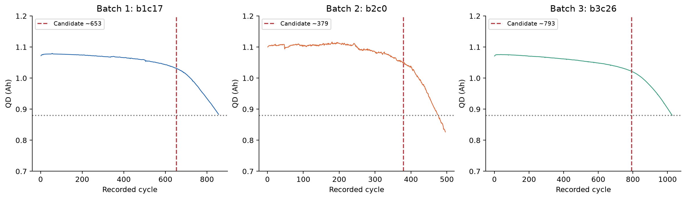
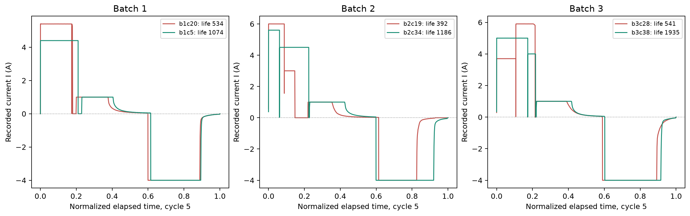

## 분석 목적과 데이터 품질

### DAY 1 분석 목적

처음 100사이클에서 확보할 수 있는 신호로 배터리 셀의 총수명을 예측하는 회귀 전략을 수립한다. 세 배치의 EDA를 통해 핵심 신호, 배치 차이, 라벨 신뢰성과 모델 복잡도의 한계를 확인했다. 모델 학습·성능 평가는 이번 보고서의 범위가 아니다.

| 정의 | 본 프로젝트의 선택 |
| --- | --- |
| 분석 단위 | 배터리 셀 1개 = 모델 표본 1개. 116,722개 사이클 행을 독립 표본으로 취급하지 않는다. |
| X: 예측 시점의 입력 | 초기 100사이클까지의 방전곡선 변화, 용량 추세, 충전 조건, 온도·저항 |
| Y: Target | 원본 cycle_life: SOH 80%에 해당하는 총수명(사이클). 100사이클 시점 RUL과 구분. |
| 핵심 선택 | ΔQ log 분산으로 작은 기본 모델을 시작하고, 용량 기울기·충전시간·C-rate·온도를 단계적으로 추가한다. |
| 검증 원칙 | Batch 1 내부 CV·Hold-out으로 선택. Batch 2 필수 외부 평가, Batch 3 추가 평가. |

### 한눈에 보는 핵심 발견

전체 139개 셀 중 수명 라벨은 129개다. ΔQ log 분산과 수명의 상관은 Batch 1/2/3에서 -0.871/-0.709/-0.797로 방향이 일관된다. 충전시간과 초기 용량 기울기는 배치별 방향이 달라 조건 의존성이 크다. 따라서 모든 후보를 한 번에 넣는 전략을 피한다.

| 배치 | 전체 / 라벨 | 결측 라벨 | 완료 불확실 | 파일 날짜 |
| --- | --- | --- | --- | --- |
| Batch 1 | 46 / 46 | 0 | 10 | 2017-05-12 |
| Batch 2 | 47 / 39 | 8 | 4 | 2018-02-20 |
| Batch 3 | 46 / 44 | 2 | 2 | 2018-04-12 |

### 수집·처리

Kaggle 지정 MAT의 셀·summary·cycles를 실제 사이클 번호로 연결했다. 피처 계산에서 용량 ≤0 또는 >1.32 Ah, IR ≤0, 온도 ≤0 또는 >100°C, 충전시간 ≤0은 결측 처리하고 원본 summary는 보존했다. 결측 라벨 10개와 완료 불확실 16개는 겹치므로 합산하지 않는다.

### 라벨 신뢰성과 출처

Batch 1·3의 유효 라벨은 마지막 기록+1, Batch 2는 최초 QD<0.88 Ah 사이클이다. 종료 QD>0.885 Ah 또는 미제공은 완료 불확실로 표시했다. 실습 Batch 2(2018-02-20)는 연구진 공개 로더(2017-06-30)와 달라 병합·제외 인덱스를 그대로 적용하지 않았다.

## Q1. 수명 분포와 배치 간 차이

### 탐색 목적

학습 범위와 외부 평가 범위가 얼마나 다른지 확인하고, 짧은 수명이 일부 오류인지 일반적인 배치 특성인지 구분한다. 150~2,300사이클의 같은 축으로 비교한다.

| 배치 | 중앙값 / 평균 | 범위 | <500 | >1000 |
| --- | --- | --- | --- | --- |
| Batch 1 | 858.5 / 844.7 | 534~1227 | 0 (0.0%) | 10 (21.7%) |
| Batch 2 | 472.0 / 565.7 | 392~1186 | 28 (71.8%) | 3 (7.7%) |
| Batch 3 | 1005.5 / 1059.7 | 541~1935 | 0 (0.0%) | 23 (52.3%) |

### 관찰·배치 비교

Batch 1은 중앙값 858.5로 중간 수명에 집중한다. Batch 2는 중앙값 472.0이고 71.8%가 500 미만으로, 단수명이 지배적이다. Batch 3는 중앙값 1005.5이고 52.3%가 1000 초과다. 세 배치 모두 오른쪽 꼬리가 있으나 Batch 2·3에서 더 두드러진다.

### 시사점 → 전략

Batch 1의 유효 수명 범위는 534~1227이다. Batch 2의 <534 구간과 Batch 3의 >1227 구간은 학습 타깃 범위 밖이므로 해당 구간의 잔차와 MAPE를 별도로 점검한다. 이것이 입력 X의 외삽을 확정하는 것은 아니며, 실제 입력 피처의 지원 범위도 함께 확인해야 한다.

### 분모와 그룹 정의

비율의 분모는 수명 라벨이 있는 셀 46/39/44개다. EDA의 장·단수명 기준(>1000/<500)과 분류 과제의 기준(≥550/<550)은 다른 정의다. 500~1000은 중간 그룹이다.

## Q1. 짧은 셀의 원인 가설과 이상치 검토

| 배치 | 배치 내 최단 셀 | 수명 | 충전 정책 | 종료 QD |
| --- | --- | --- | --- | --- |
| Batch 1 | b1c20 | 534 | 5.4C(80%)-5.4C | 0.881 Ah |
| Batch 2 | b2c19 | 392 | 6C(60%)-3C | 0.826 Ah |
| Batch 3 | b3c28 | 541 | 3.7C(31%)-5.9C-newstructure | 0.880 Ah |

### 통계적 이상치 확인

배치별 1.5×IQR 기준에서 낮은 수명 이상치는 모두 0개다. 짧은 셀을 자동으로 이상치라고 부르면 안 된다. 높은 수명 후보는 Batch 1 0개, Batch 2 9개, Batch 3 3개다. 분포의 꼬리라는 이유만으로 정상 장수명 셀을 삭제하지 않는다.

### 짧은 셀의 근거: b2c19

수명 392사이클, 정책 6C(60%)-3C다. 최초 QD<0.88 Ah 사이클도 392로 타깃과 일치한다. ΔQ log 분산은 -3.292로 Batch 2 장수명 그룹 중앙값 -4.271보다 크다. 실제 초기 곡선 변화가 큰 짧은 셀이며, 종료 기록 오류만으로 짧아진 사례라는 근거는 없다.

### 프로토콜 대조

같은 6C(60%)-3C 정책의 평균 수명은 400.0±11.3(n=2)이다. 다른 짧은 정책인 3.6C(9%)-5C도 394.5±2.1(n=2)로 짧다. 첫 단계 C-rate가 낮아도 뒤 단계가 높을 수 있어 “첫 단계가 빠르기 때문에 짧다”는 단일 설명은 부족하다.

### 완료 불확실 셀과의 차이

예를 들어 b1c0는 라벨 1190이지만 마지막 용량 1.026 Ah로 아직 0.88 Ah에 도달하지 않았다. 이런 라벨 신뢰성 문제와 실제 단수명을 분리해야 한다. 높은 수명 정책 평균에는 완료 불확실 셀이 포함될 수 있으므로 그대로 정책 우열을 결론내리지 않는다.

### 시사점 → 처리

짧은 정상 셀을 삭제하지 않고, 결측 라벨·종료 불확실·측정 오류를 각각 플래그로 관리한다. 짧은 수명의 확정 원인은 실험 통제나 추가 메타데이터 없이는 규명할 수 없다. ΔQ·후반 충전 단계·온도 차이는 검증할 가설이다.

## Q2. 용량 열화와 가속 열화 시작점

| 배치 | 초기 평균 QD의 셀 평균 | 초기 기울기 >0인 셀 | 초기 QD 기울기 vs 수명 ρ |
| --- | --- | --- | --- |
| Batch 1 | 1.082 Ah | 12 / 46 | +0.578 |
| Batch 2 | 1.091 Ah | 23 / 47 | -0.271 |
| Batch 3 | 1.066 Ah | 1 / 46 | +0.184 |

| 배치 | 후보 / 전체 | knee 사이클 중앙값 | knee / 수명 중앙값² |
| --- | --- | --- | --- |
| Batch 1 | 45 / 46 | 608.5 | 75.2% (n=45) |
| Batch 2 | 44 / 47 | 354.2 | 78.2% (n=39) |
| Batch 3 | 46 / 46 | 830.0 | 79.2% (n=44) |

### 발견 → 초기 피처

완만한 감소 뒤 말기 가속이 보이지만 초기 기울기가 양수인 셀도 12/23/1개다. 기울기와 수명 상관은 +0.578/-0.271/+0.184로 변해 추가 효과를 CV로 검증한다. 곡선 길이는 측정 종료에도 영향을 받는다.

### knee 규칙과 한계

QD 0.80~1.32 Ah, cycle≥10에 11점 중앙값 평활화 후 기록 15~85% 구간의 연속 두 직선을 탐색했다. SSE 20% 개선·후반 음의 기울기·절댓값 1.5배 초과 조건이다. 이는 물리적 확정점이 아닌 후보이며 전체 기록을 사용하므로 입력에서 제외한다. 상대 위치는 셀별 knee/life 중앙값; 결측 라벨은 제외한다. Batch 2 라벨 이후 기록도 탐색에 포함한다.

## Q3. 초기 ΔQ 곡선과 장·단수명 그룹

### 계산 정의

실제 사이클 번호 100과 10을 선택하고, 동일 Vdlin 축에서 ΔQ(V)=Q100(V)-Q10(V)를 계산했다. 시간축이 다른 원시 Qd를 직접 빼지 않는다. 전압은 가이드의 설명 범위 대신 실제 Vdlin 3.5→2.0 V를 사용했다.

| 배치 / 그룹 | n | log10 분산 중앙값 | ΔQ 최솟값 중앙값 | ΔQ 평균 중앙값 |
| --- | --- | --- | --- | --- |
| Batch 1 / 중간 | 36 | -3.786 | -0.0383 | -0.0172 |
| Batch 1 / 장수명 | 10 | -4.310 | -0.0221 | -0.0093 |
| Batch 2 / 단수명 | 28 | -3.446 | -0.0562 | -0.0287 |
| Batch 2 / 중간 | 8 | -4.153 | -0.0271 | -0.0112 |
| Batch 2 / 장수명 | 3 | -4.271 | -0.0192 | -0.0081 |
| Batch 3 / 중간 | 21 | -4.091 | -0.0276 | -0.0118 |
| Batch 3 / 장수명 | 23 | -4.316 | -0.0201 | -0.0087 |

### 발견과 그룹 해석

선은 그룹 중앙값, 음영은 IQR이다. Batch 2 단수명은 약 3 V에서 더 깊은 음의 변화와 큰 log 분산을 보인다. Batch 1·3에는 <500 그룹이 없어 중간/장수명을 비교했다. Batch 2 장수명 n=3은 안정성이 제한적이다.

### 피처 정의 → 선택

log_var_delta_q=log10(var(ΔQ, ddof=1)); 최솟값·평균도 추출했다. 동일 실제 Vdlin 3.5→2.0 V, 유효점 ≥900 조건을 사용했다. 장수명일수록 변화가 작은 경향이 일관되어 log 분산을 핵심으로 선택한다. 완료 불확실을 제외한 Batch 1에서도 ρ=-0.826(n=36)이다.

## Q4. 충전 정책과 수명: 고속이면 짧은가?

### 관찰

Batch 1에서 5.4C(80%)-5.4C는 평균 546.5(n=2), 8C(35%)-3.6C는 607.5(n=2)다. 더 빠른 첫 단계 정책이 항상 더 짧지 않다. Batch 3의 4.8C(80%)-4.8C는 평균 1564.2(n=6)로 긴 편이지만 다른 프로토콜·전환 SOC·배치 조건도 함께 다르다.

### 그룹 크기와 라벨 영향

막대는 평균, 에러바는 표준편차이며 신뢰구간이 아니다. n=1은 표준편차 추정 불가다. Batch 1의 상위 평균 정책에는 완료 불확실 셀이 있어 우열을 확정할 수 없다. Batch 2에서 유효 라벨이 없는 정책은 그래프에서 제외하고 정책표에는 남겼다.

### 시사점 → 피처·모델

정책을 c1·soc_switch·c2로 분해하고 실제 충전시간·전류를 함께 검토한다. 첫 단계 C-rate 하나로 수명을 설명하지 않는다. 정책별 타깃 평균을 그대로 입력하는 target encoding은 작은 그룹과 누수 위험이 커서 초기 모델에서 사용하지 않는다.

## Q4. 실제 전류 패턴과 초기 열화의 관계

| 배치 | 실측 전류 vs 초기 QD 기울기 ρ | c1 vs 수명 ρ | 충전시간 vs 수명 ρ |
| --- | --- | --- | --- |
| Batch 1 | +0.408 | -0.483 | +0.613 |
| Batch 2 | -0.444 | +0.055 | -0.387 |
| Batch 3 | -0.103 | -0.229 | +0.196 |

### 파형의 의미

cycle 5의 경과시간을 0~1로 정규화했다. 양수는 충전, 음수는 방전이다. 배치별 완료 불확실이 없는 최소·최대 수명 셀 6개 예시로, 그룹 대표 표본은 아니다. b3c28은 첫 단계 3.7C지만 뒤 단계 5.9C로 최대 I=5.90 A; 장수명 b3c38은 최대 5.00 A다.

### 전류 요약과 배치 비교

초기 1~5사이클에서 I>0.1 A 중앙값의 셀별 평균을 사용했다. 전류-기울기 표본은 46/47/46, 수명 상관은 46/39/44개다. 전류-기울기와 충전시간-수명은 배치별 부호가 달라 고속 충전의 인과 효과를 확정하지 않는다.

### 시사점 → 검증

c1만으로 후반 세기·전환 SOC를 표현하기 어렵다. ΔQ 기본형에 충전시간·c1을 단계적으로 추가한다. 전류 상위 분위수·단계별 체류시간은 후속 후보이며 아직 전체 셀에서 검증한 입력이 아니다.

## Q5. 수명 관련 신호와 변수 중복

| 초기 피처 | Batch 1 ρ (n) | Batch 2 ρ (n) | Batch 3 ρ (n) |
| --- | --- | --- | --- |
| log_var_delta_q | -0.871 (46) | -0.709 (39) | -0.797 (44) |
| min_delta_q | +0.850 (46) | +0.661 (39) | +0.776 (44) |
| mean_delta_q | +0.828 (46) | +0.697 (39) | +0.756 (44) |
| mean_chargetime | +0.613 (46) | -0.387 (39) | +0.196 (44) |
| qd_slope_10_100 | +0.578 (46) | -0.271 (39) | +0.184 (44) |
| c1 | -0.483 (46) | +0.055 (39) | -0.229 (44) |
| mean_tavg | -0.371 (46) | +0.176 (39) | +0.025 (44) |
| mean_ir | +0.189 (46) | -0.199 (33) | +0.169 (44) |

| 변수 쌍 | Batch 1 | Batch 2 | Batch 3 |
| --- | --- | --- | --- |
| log_var_delta_q / min_delta_q | -0.987 | -0.982 | -0.982 |
| log_var_delta_q / mean_delta_q | -0.971 | -0.967 | -0.972 |
| min_delta_q / mean_delta_q | +0.989 | +0.950 | +0.985 |
| mean_tavg / mean_tmax | +0.951 | +0.759 | +0.975 |
| c1 / soc_switch | -0.869 | -0.239 | -0.649 |

### 핵심 발견 → 처리

제시한 초기 후보 중 log 분산의 절대 상관이 세 배치에서 가장 크다. 반면 충전시간·기울기·온도는 조건 의존적이다. ΔQ 요약량 |ρ|≈0.95~0.99와 온도 중복 때문에 요약량 하나·온도 하나로 시작하고 Ridge/ElasticNet을 비교한다.

### 상관의 한계

표는 쌍별 결측 제외 Spearman과 n이다. 상관은 성능·인과·독립 효과를 입증하지 않는다. 단조 중복은 VIF와 같지 않으며 필요 시 학습 fold 안에서 Pearson/VIF를 확인한다.

## Feature Engineering: 핵심·추가·제외 변수

| 피처 묶음 | 사용할 입력 | 선정 이유 / 확인할 사항 |
| --- | --- | --- |
| G0 핵심 기본형 | log_var_delta_q | 세 배치 일관된 방향, 완료 불확실 제외에도 관계 유지. 먼저 이 신호만으로 기준을 만든다. |
| G1 초기 추세 | G0 + qd_slope_10_100 | 열화 곡선의 국소 추세. 배치별 부호 차이 때문에 추가 효과를 검증한다. |
| G2 충전 조건 | G1 + mean_chargetime + c1 | 정책·실측 조건 보완. 충전 조건이 바뀌는 환경에서도 일반화 가능한지는 미확정. |
| G3 열적 조건 | G2 + mean_tavg | 온도 영향 후보. Tmax는 중복이 커서 동시에 쓰지 않는다. |
| 대체 / 확장 후보 | min_delta_q, mean_delta_q, IR 변화, c2, 전환 SOC, 실측 전류 | 핵심 ΔQ 요약량 교체 또는 정규화 비교. 추가 변수가 필요하다는 근거는 CV로 확인. |
| 입력 제외 | cycle_life, label550, last_cycle, 전체 knee, 종료 QD, observed_eol_cycle, 배치 ID·셀 ID | 타깃 또는 예측 시점 이후 정보, 식별자. 완료 플래그는 라벨 검토용이며 X가 아니다. |

### 선별 절차

G0→G1→G2→G3를 동일한 Batch 1 분할로 비교한다. 후보 집합은 좁게 유지하고 추가로 얻는 CV MAPE 개선과 fold 간 안정성을 확인한다. 개선이 작거나 불안정하면 더 단순한 집합을 선택한다. 실제 최종 집합은 DAY 2 검증 후 확정한다.

### 예측 시점과 결측

summary 평균은 cycle≤100, 기울기는 10~100, IR 변화는 1~10 대비 91~100, 실측 전류는 1~5를 사용한다. 결측 대체는 학습 fold 중앙값으로 한다. 결측 표시 피처를 추가할 경우에도 초기 관측에서 계산한 표시만 허용한다.

## 회귀 선택과 Target Variable

| 항목 | 회귀: 이번 선택 | 분류: 선택하지 않은 이유 |
| --- | --- | --- |
| 예측 시점 / 타깃 | 100사이클 / cycle_life 수치 | 5사이클 / life≥550이면 1 |
| 정보 활용 | ΔQ100−10과 100사이클 요약 사용 가능 | ΔQ100−10을 사용하면 시점 위반 |
| Batch 1 분포 | 연속 수명 534~1227 활용 | 클래스 0/1 = 1/45로 검증 매우 불안정 |
| 업무 해석 | 셀별 예상 사이클 수·선별 우선순위 | 550 기준 통과 여부로 정보가 압축됨 |

### 변환 전후 확인

원 수명→자연로그 수명의 왜도는 Batch 1 0.45→0.04, Batch 2 1.64→1.36, Batch 3 1.26→0.52다. 로그 후 일부 비대칭은 줄지만 모든 배치가 정규분포가 되는 것은 아니다.

### 시사점 → 타깃 처리

Batch 1에서 원 타깃과 log 타깃을 제한된 후보로 비교한다. log 모델은 예측 후 exp로 사이클 단위로 복원하고 원 단위 MAPE·MAE·RMSE로 평가한다. MAPE 최적과 log 제곱오차 최적은 같지 않으므로 변환을 자동 확정하지 않는다. 매출 예시의 Tweedie 분포를 배터리 수명에 그대로 적용하지 않는다.

## EDA 특성에 근거한 후보 모델

| 후보 | EDA 근거와 알고리즘 관점 | 복잡도·선택 조건 |
| --- | --- | --- |
| 중앙값 기준 모델 | 작은 표본에서도 해석 가능한 비교 기준. 배치별 수명 범위 차이의 영향을 확인. | 모든 학습 fold의 라벨 중앙값만 사용. 학습 데이터 밖 타깃을 참조하지 않는다. |
| Ridge / ElasticNet | ΔQ 요약량·온도 중복과 46개 이하의 작은 학습 표본. 계수를 정규화해 분산을 줄인다. | 중앙값 대체→표준화→정규화 회귀. alpha는 작은 로그 간격 후보, ElasticNet 혼합비도 좁게 비교. |
| Random Forest | 충전 조건·온도와 곡선 변화의 비선형 상호작용 가능성. 분할 평균으로 비선형을 표현한다. | 깊이·최소 리프 표본을 제한. 타깃 학습 범위 밖으로 직접 외삽하기 어려워 장수명 구간 오차를 확인. |
| 얕은 Gradient Boosting | 단순 모델에 남는 비선형 잔차를 작은 트리로 순차 보완한다. | 깊이 1~2, 적은 트리·낮은 학습률을 제한적으로 비교. 작은 표본에서 튜닝 폭을 넓히지 않는다. |

### 왜 딥러닝·1000차원 곡선 모델을 우선 쓰지 않는가?

학습 독립 표본은 Batch 1 최대 46개이며 라벨 검토 후 더 줄 수 있다. 116,722개 사이클 행이 독립 셀 표본 수를 늘려주지는 않는다. 많은 파라미터나 곡선 포인트로 시작하면 표본 대비 복잡도가 커지고 검증이 불안정해진다.

### 최종 선택 원칙

CV 평균 MAPE가 낮고 fold 간 변동이 작은 후보를 우선한다. 성능 차이가 미미하면 피처 수와 복잡도가 작은 모델을 선택한다. 정규화 회귀도 외삽이 항상 정확한 것은 아니므로 Batch 2·3 평가에서 실제 한계를 보고한다.

## 검증 전략·분석 한계·참고 자료

### 학습 라벨 품질의 기본안

Batch 1 완료 불확실 10개를 제외한 36개를 주 분석 대상으로 검토하고, 46개 전체를 사용한 민감도 비교를 별도로 보고한다. 제외는 명시한 종료 용량 기준에 따르며 결과를 보고 유리한 셀만 삭제하지 않는다. 어느 라벨 정책을 주 결과로 삼을지는 분할 전에 고정한다.

### 분할

셀 단위 Hold-out 약 20%를 random_state=42로 먼저 고정한다. 충전 프로토콜 그룹 분리를 우선 검토하고 그룹 수·학습 표본 수가 허용하면 학습 부분에서 GroupKFold 약 5분할을 사용한다. 그룹 분리가 불가능하면 셀 단위 분할의 한계를 공개한다. Hold-out은 피처·튜닝 선택에 사용하지 않는다.

### Pipeline

각 CV 학습 fold에서 결측 중앙값 대체→선형 모델용 StandardScaler→모델 fit을 수행한다. 트리 모델은 불필요한 스케일링을 생략한다. 초기 측정치 기반 결측 지표는 선택 후보이며 전체 기록의 invalid 카운트는 입력에서 제외한다. 선택한 피처·파라미터·타깃 변환은 Hold-out 및 외부 평가 전에 고정한다.

### 외부 평가와 지표

Batch 2의 유효 라벨 39개로 최종 평가하되 명시한 품질 정책을 일관되게 적용하고 평가 n을 보고한다. Batch 3도 같은 정책으로 추가 평가한다. 주 지표 MAPE=100×mean(|y−ŷ|/y), 보조 MAE·RMSE를 사이클 단위로 보고한다. 타깃이 모두 양수여서 0 나눗셈은 없지만 작은 수명에 상대 오차가 더 민감하다.

### 오차를 어떻게 해석하는가?

CV 평균과 표준편차, Hold-out, Batch 2·3를 분리한다. Gap은 Valid−CV, Test−Valid, Test−9.1%(%p)로 정의한다. 큰 오차 셀의 수명 구간·충전 정책·초기 곡선·결측 패턴을 확인하고 편향을 설명한다. 이때 외부 타깃으로 다시 튜닝하지 않는다.

### 외부 EDA의 한계

DAY 1 요구에 따라 세 배치의 라벨을 이미 관찰했다. 외부 데이터를 완전히 눈가림했다고 주장하지 않는다. 배치별 관찰은 해석과 검증 위험 설명에 사용하고, 실질적인 모델·피처 선택은 Batch 1 학습 부분 안에서 수행한다.

### 업무 활용과 완료 범위

초기 총수명 예측은 셀 선별·교체 우선순위의 참고 근거다. 실제 ESS 적용에는 운전 조건·캘린더 열화·불확실성 검증이 필요하다. DAY 1 EDA·설계를 완료했으며 모델 학습은 DAY 2다. 9.1% MAPE는 달성 성능이 아니다.

### 재현 자료와 출처

전체 해석·통계는 상세 원고와 실행 노트북에 보존했다. 실습: actually-war-1ea.notion.site/DS-Mini-Project-32d7f4c8669380338a27f90c471c1fcb
데이터: kaggle.com/datasets/itshpark/data-driven-prediction-of-battery-cycle
로더: github.com/rdbraatz/data-driven-prediction-of-battery-cycle-life-before-capacity-degradation
Severson et al. (2019), Nature Energy. DOI: 10.1038/s41560-019-0356-8
