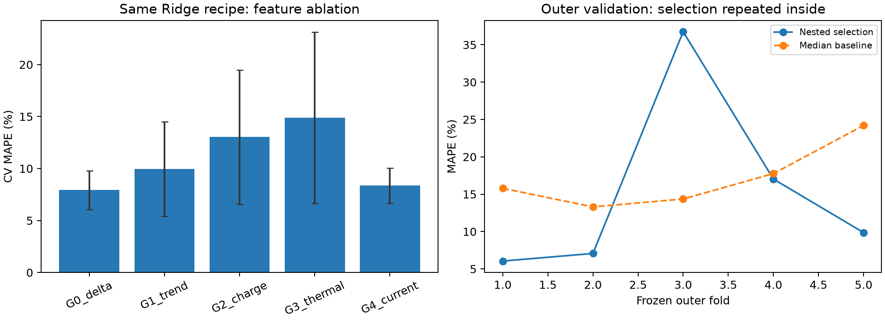

# DAY 2 | 배터리 수명 예측 모델 개발 및 평가

> **결론** · Batch 1의 정책 그룹 분리 교차검증으로 모델을 선택하고, 별도 Hold-out과 Batch 2에 순서대로 적용했다. 모든 수치는 실제 실행 결과다.

**핵심 판단**

- 선택용 CV는 7.93%지만 선택 과정을 다시 수행한 중첩 CV는 15.35%다. 작은 표본에서 모델 선택이 불안정함을 확인했다.
- Batch 2 MAPE는 25.69%로 학습 중앙값 기준 58.73%보다 개선됐지만 논문 비교 기준 9.1%에는 미달했다.
- Batch 2의 실제 단수명 28셀 중 21셀(75%)을 경고하지 못해 단수명 선별·보증·안전 판단에 직접 사용하기 어렵다.

## 1. DAY 1 전략 → 구현

| DAY 1 관찰 | DAY 2 구현 |
| --- | --- |
| 초기 ΔQ log 분산의 일관된 수명 관계 | G0 핵심 입력으로 사용; G1~G3 및 RMS 전류 G4를 단계적으로 비교 |
| 충전·온도 변수의 조건 의존성 및 ΔQ 변수 중복 | 좁은 피처 묶음과 Ridge/ElasticNet 정규화, 작은 트리 후보 비교 |
| 셀 수가 적고 같은 충전 정책의 셀이 존재 | 셀 단위 표본, 정책 그룹이 겹치지 않는 Batch 1 CV와 Hold-out 사용 |
| 전체 기록으로 계산한 knee는 미래 정보 | 초기 피처 화이트리스트로 knee·종료 QD·라벨·셀 ID 차단 |

선택된 사양은 **G0_delta / Ridge (alpha=0.1) / raw 타깃**이다. 입력은 `log_var_delta_q`다.

## 2. 분할과 파이프라인

Batch 1에서 수명 라벨이 있고 종료 유효 QD≤0.885 Ah인 36셀을 주 분석에 사용했다. 사전에 고정된 정책 그룹 분할(seed=42)로 Train/CV 29셀·16그룹과 Hold-out 7셀·4그룹을 나눴다. Train의 GroupKFold 5개 fold는 검증 6/6/6/6/5셀이고 각 경계에서 정책 중복 0개다. Batch 2는 39셀, Batch 3는 44셀을 같은 라벨 품질 기준으로 평가했다.

각 fold의 학습 부분만으로 결측 중앙값과 선형 모델의 표준화를 적합했다. 원 타깃과 자연로그 타깃을 제한된 후보로 비교했고, 로그 예측은 exp로 원 사이클 단위에 복원했다. 모든 예측은 최소 1사이클로 제한했다. Hold-out과 외부 배치의 라벨은 피처·모델·설정 선택에 사용하지 않았다.

중앙값 기준 모델의 CV 평균 MAPE는 **17.08%**다. 총 80개 사전 정의 후보를 같은 분할에서 비교해 평균 CV MAPE가 가장 작은 사양을 선택했다. 동률이면 fold 표준편차·피처 수·모델 단순성을 순서대로 적용한다. 작은 데이터에서 후보 수가 많아 CV 선택 편향이 남을 수 있다.

상위 후보의 동일 분할 비교는 다음과 같다. 이 표의 수치는 Hold-out이나 Batch 2를 본 뒤 재선정한 값이 아니다.

| 피처 묶음 | 모델 | 타깃 | CV MAPE 평균 (%) | fold 표준편차 (%p) |
| --- | --- | --- | ---: | ---: |
| G0_delta | Ridge (alpha=0.1) | raw | 7.93 | 1.88 |
| G0_delta | ElasticNet (alpha=0.01,l1=0.5) | raw | 7.93 | 1.88 |
| G0_delta | ElasticNet (alpha=0.1,l1=0.5) | raw | 7.98 | 1.92 |
| G4_current | ElasticNet (alpha=0.1,l1=0.5) | raw | 8.22 | 1.80 |
| G0_delta | ElasticNet (alpha=0.01,l1=0.5) | log | 8.24 | 2.00 |
| G0_delta | Ridge (alpha=0.1) | log | 8.25 | 1.93 |

## 3. 가이드 형식 성능 결과

| 구분 | MAPE (%) | 비고 |
| --- | ---: | --- |
| Train (Batch 1 CV) | 7.93 ± 1.88 | 5개 검증 fold MAPE의 평균 ± 표준편차 |
| Valid (Batch 1 Hold-out) | 10.76 | 선택된 모델을 Train 29셀로 적합 후 7셀에서 1회 평가 |
| Test (Batch 2) | 25.69 | 사양 고정 후 Batch 1의 36셀로 재학습해 39셀 평가 |
| Gap (Train-Valid) | 2.83 %p | Valid − CV; 양수면 내부 검증 악화 |
| Gap (Valid-Test) | 14.93 %p | Test − Valid; 양수면 외부 배치 악화 |
| Gap (Target-Test) | 16.59 %p | Test − 9.1%; 원논문 비교 기준과 데이터·라벨 정책 차이 있음 |
| Test (Batch 3, 추가) | 12.08 | 모델 변경 없이 44셀 평가 |
| Gap (Batch 2-Batch 3) | -13.61 %p | Batch 3 − Batch 2 |

보조 지표 MAE/RMSE는 Batch 2에서 129.58/153.23사이클이다. Batch 2 MAPE의 정책군 복원추출 2,000회 탐색적 95% 구간은 [17.90, 35.18]%다. 이는 모델 선택 불확실성·미관측 배치 차이를 포함하지 않는다.

## 4. Batch 2 오류 분석

모델 선택용 Train 29셀의 실제 수명 범위는 534~1054사이클이다. Batch 2 평가 39셀 중 30셀은 이보다 짧고 2셀은 길다. 외부 평가에 사용한 최종 모델은 Hold-out까지 포함한 Batch 1의 36셀(534~1074사이클)로 재학습했다. Batch 2의 범위 밖 셀 수는 이 기준에서도 30/2셀로 같다. 아래 표는 모델 선택용 Train 범위별 오차다.

| 실제 수명 구간 | n | MAPE (%) | 평균 예측−실제 (사이클) |
| --- | ---: | ---: | ---: |
| above_train | 2 | 7.41 | -85.46 |
| below_train | 30 | 28.76 | 128.81 |
| within_train | 7 | 17.76 | 142.15 |

핵심 입력 `log_var_delta_q`의 Batch 1 Train 범위는 -4.146~-3.350이다. Batch 2에서는 이 입력 범위 안에 있는 셀도 크게 틀렸다. 따라서 타깃의 범위 차이만으로 오차를 설명하거나, 모든 실패를 입력 외삽 탓으로 돌릴 수 없다.

| ΔQ 입력 범위 | n | MAPE (%) | 평균 예측−실제 (사이클) |
| --- | ---: | ---: | ---: |
| outside_input | 18 | 13.99 | 66.12 |
| within_input | 21 | 35.71 | 166.58 |

충전 정책군별로도 오차가 균일하지 않다. 다음은 큰 오차 정책군 2개와, 단수명임에도 상대적으로 잘 맞은 정책군 1개다. 각 군의 표본 수가 작아 정책 효과의 인과 추정은 아니다.

| 정책군 (c1 / 전환 SOC / c2) | n | 실제 수명 중앙값 | MAPE (%) | 평균 예측−실제 |
| --- | ---: | ---: | ---: | ---: |
| 3.6 / 0.09 / 5 | 2 | 394.50 | 64.13 | 252.96 |
| 5.2 / 0.5 / 4.25 | 5 | 449.00 | 43.01 | 194.09 |
| 3.6 / 0.3 / 6 | 2 | 421.00 | 1.14 | 4.86 |

절대 백분율 오차가 큰 5셀은 다음과 같다. 단수명 셀은 MAPE에서 같은 사이클 오차도 더 크게 반영된다.

| 셀 | 실제 | 예측 | 절대오차율 (%) | 충전 정책군 |
| --- | ---: | ---: | ---: | --- |
| b2c18 | 449.00 | 744.41 | 65.79 | 5.2 / 0.5 / 4.25 |
| b2c6 | 393.00 | 651.09 | 65.67 | 3.6 / 0.09 / 5 |
| b2c15 | 396.00 | 643.83 | 62.58 | 3.6 / 0.09 / 5 |
| b2c2 | 424.00 | 614.35 | 44.89 | 5.2 / 0.5 / 4.25 |
| b2c29 | 452.00 | 639.62 | 41.51 | 5.2 / 0.58 / 4 |

Batch 2에서 짧은 셀의 수명을 평균적으로 과대 예측했다. ESS 셀 선별에 그대로 쓰면 빨리 열화될 셀을 오래갈 것으로 판단할 수 있으므로, 초기 신호만으로 확정하지 않고 짧은 수명 위험 구간의 추가 시험이 필요하다. Batch 3에서는 모델 선택용 Train 상한 1054사이클보다 긴 17셀의 수명을 평균적으로 과소 예측했다(외부 평가용 재학습 36셀 상한 1074를 기준으로 하면 16셀).

오차의 원인 가설은 Batch 2의 짧은 수명 집중, 충전 정책 구성 차이, 종료 라벨 정의와 기록 품질 차이다. 이 자료만으로 특정 충전 조건의 인과 효과를 확정할 수는 없다.

## 5. ESS 관점과 한계

초기 시험 신호가 신뢰할 수 있는 범위에서 예상 수명은 셀 선별·추가 시험 순서·교체 우선순위의 보조 지표가 될 수 있다. 실제 ESS 운영의 보증·안전 판단에 직접 쓰려면 운전 온도, 부분 충방전, 캘린더 열화, 제조 편차를 포함한 현장 데이터에서 다시 검증해야 한다.

Hold-out은 7셀이고 Batch 2 정책군은 9개라 추정이 불안정하다. 종료 QD 기준은 라벨 진실성을 보증하지 않고 일부 셀을 제외해 모집단이 바뀐다. DAY 1 EDA에서 외부 배치의 라벨·분포를 이미 관찰했으므로 완전히 눈가림한 시험도 아니다. 논문의 9.1%와 직접 같은 실험으로 간주하지 않는다.

## 6. 재현

`python src/train.py --root .`로 같은 CSV·PNG·보고서를 다시 생성한다. `notebooks/03_modeling.ipynb`는 실행 과정과 결과 해석을 보여준다. 후보별 결과는 `results/day2_candidates.csv`, fold별 결과는 `results/day2_cv_folds.csv`, 셀별 예측은 `results/day2_predictions.csv`, 가이드 형식 표는 `results/model_performance.csv`, 상세 수치는 `results/day2_performance.csv`에 저장된다.

## 7. 모델 선택 편향과 피처 추가 효과

### 선택 과정을 포함한 중첩 교차검증

Batch 1 Train 29셀만 사용했다. 고정된 5개 outer fold 각각에서 남은 정책 그룹을 GroupKFold 4개 inner fold로 나눠 80개 후보를 다시 선택하고, 선택에 쓰이지 않은 outer fold에서 평가했다. 모든 inner/outer 경계의 셀·정책 그룹 중복을 검사했다. Hold-out·Batch 2·3는 이 과정에 들어가지 않는다.

중첩 CV outer MAPE는 **15.35 ± 12.70%**, 전체 outer 예측을 모은 OOF MAPE는 **15.54%**다. 동일 outer fold의 중앙값 기준은 17.08%다. 기존 7.93%는 후보를 고를 때 사용한 CV 점수이고, 중첩 결과는 후보 선택을 반복하는 절차에 대한 보조 추정이다. 평균 fold MAPE와 전체 OOF MAPE는 fold 크기가 달라 같지 않을 수 있다.

| Outer fold | 선택 피처 | 선택 모델 | Outer MAPE (%) | 중앙값 MAPE (%) |
| --- | --- | --- | ---: | ---: |
| 1 | G0_delta | ElasticNet | 6.05 | 15.78 |
| 2 | G0_delta | ElasticNet | 7.07 | 13.30 |
| 3 | G3_thermal | Ridge | 36.74 | 14.36 |
| 4 | G0_delta | RandomForest | 17.03 | 17.76 |
| 5 | G0_delta | ElasticNet | 9.86 | 24.20 |

Outer fold 3에서는 inner MAPE 6.92%로 G3의 로그 타깃 Ridge가 선택됐지만 outer MAPE는 36.74%였다. 평균 온도까지 더한 후보가 작은 학습 집단에서 선택된 뒤 다른 정책군에서 실패하는 구체적인 예다. 최저 CV 점수 하나를 실제 운영 성능으로 해석하기 어렵다. 중첩 CV도 5~6셀씩의 검증으로 불안정하며, DAY 1의 전체 Train EDA·피처 설계까지 중첩한 것은 아니다. 따라서 완전한 독립 검증이나 모집단 성능 보증으로 해석하지 않는다. 이번 추가 검증 결과로 외부 결과를 다시 튜닝하지 않았다.

### 같은 모델에서 피처만 변경한 비교

모델·설정·타깃을 Ridge / alpha=0.1 / raw로 고정하고 같은 CV fold에서 입력만 바꿨다. Δ는 해당 묶음 MAPE − G0 MAPE이며 음수일 때 개선이다. 서로 다른 최적 모델을 비교하는 것보다 변수 추가 효과를 분리해서 확인할 수 있다.

| 피처 묶음 | CV MAPE (%) | G0 대비 Δ (%p) | 개선된 fold / 5 |
| --- | ---: | ---: | ---: |
| G0_delta | 7.93 ± 1.88 | +0.00 | 0/5 |
| G1_trend | 9.96 ± 4.55 | +2.03 | 1/5 |
| G2_charge | 13.03 ± 6.47 | +5.10 | 0/5 |
| G3_thermal | 14.89 ± 8.21 | +6.96 | 0/5 |
| G4_current | 8.36 ± 1.68 | +0.42 | 2/5 |

작은 표본에서 추가 피처가 도움이 되는지는 fold마다 달라질 수 있다. 이 표와 저장된 fold별 값을 근거로 G0의 간결함을 판단하며, 낮은 상관이나 CV 악화만으로 충전·온도가 물리적으로 중요하지 않다고 결론 내리지 않는다.

## 8. 외부 성능 차이의 추가 근거

### 같은 학습 데이터로 만든 중앙값 기준과 비교

Valid의 기준값은 Train 29셀의 중앙값, 외부 배치의 기준값은 재학습에 사용한 Batch 1 전체 36셀의 중앙값이다. 외부 실제 수명으로 기준값을 정하지 않았다.

| 평가 집단 | 중앙값 기준 MAPE (%) | 모델 MAPE (%) | 개선 (%p) |
| --- | ---: | ---: | ---: |
| Valid | 19.36 | 10.76 | +8.60 |
| Batch 2 | 58.73 | 25.69 | +33.04 |
| Batch 3 | 24.51 | 12.08 | +12.43 |

### Hold-out 포함 재학습의 영향

Valid는 Train 29셀 모델, 외부 평가는 Hold-out을 합친 36셀 모델로 예측했다. 따라서 Valid−Test Gap에는 평가 배치 차이와 재학습 영향이 함께 들어간다. 고정 사양을 Train 29셀로만 적합한 외부 예측도 계산해 다음처럼 분리했다. 외부 결과를 사양 선택에 사용하지 않았다.

| 배치 | Train 29셀 모델 MAPE (%) | 재학습 36셀 MAPE (%) | 재학습 차이 (%p) |
| --- | ---: | ---: | ---: |
| Batch 2 | 28.78 | 25.69 | -3.10 |
| Batch 3 | 12.10 | 12.08 | -0.02 |

Batch 2의 기준 대비 개선에 대한 정책군 단위 paired bootstrap 2,000회의 탐색적 95% 구간은 [23.47, 47.82]%p다. 고정 모델과 관측된 정책군에 대한 구간이며 새 배치나 모델 선택의 불확실성은 포함하지 않는다.

### 입력 분포와 정책 구성

아래 입력 분포 차이는 최종 학습 Batch 1의 36셀을 기준으로 (외부 평균 − 학습 평균) / 학습 표준편차로 계산했다. 절댓값이 크면 측정된 입력 분포 차이가 크다는 뜻이며 인과 관계나 실패 원인의 확정은 아니다.

| Batch 2 입력 | 표준화 평균 차이 | 학습 입력 범위 밖 / 관측 셀 |
| --- | ---: | ---: |
| log_var_delta_q | +0.84 | 17/39 |
| qd_slope_10_100 | +0.81 | 21/39 |
| mean_chargetime | +6.34 | 10/39 |
| c1 | -1.15 | 4/39 |
| mean_tavg | +0.12 | 7/39 |
| charge_rms_a | +0.75 | 6/39 |

mean_chargetime의 표준화 평균 차이는 +6.34로 크지만 최종 G0 모델은 충전시간을 직접 입력받지 않는다. 이 차이는 실험 조건 구성의 차이를 뒷받침하며, 해당 변수가 예측 오차를 일으켰다는 직접 증거는 아니다. 정책의 동일 여부는 c1·전환 SOC·c2의 정확한 조합으로 판단했다. 서로 다른 제조·운전 배치를 같은 정책이라는 이유만으로 동일 분포로 간주할 수 없다.

| 외부 배치 | Batch 1에 같은 정책 존재 | n | MAPE (%) | 평균 예측−실제 |
| --- | --- | ---: | ---: | ---: |
| Batch 2 | 없음 | 29 | 24.93 | 111.57 |
| Batch 2 | 있음 | 10 | 27.89 | 145.29 |
| Batch 3 | 없음 | 38 | 10.34 | -12.45 |
| Batch 3 | 있음 | 6 | 23.11 | -353.27 |

Batch 2에서 기존 정책 셀도 MAPE 27.89%로 신규 정책 셀의 24.93%보다 높다. 그러므로 신규 정책이라는 사실만으로 성능 저하를 설명할 수 없다. Batch 3의 기존 정책 집단은 6셀뿐이어서 작은 집단의 평균 차이를 확정적인 효과로 해석하지 않는다.

### 라벨 기준과 제외 영향

| 배치 | 전체 | 결측·무효 라벨 | 유효 라벨이지만 종료 불확실 | 주 분석 |
| --- | ---: | ---: | ---: | ---: |
| Batch 1 | 46 | 0 | 10 | 36 |
| Batch 2 | 47 | 8 | 0 | 39 |
| Batch 3 | 46 | 2 | 0 | 44 |

Batch 1에서 종료 불확실로 제외한 10셀에 고정 모델을 적용한 탐색적 MAPE는 7.46%다. 이 값은 신뢰성이 불확실한 제공 라벨과의 일치도이며 정답 수명에 대한 검증이 아니다. 해당 셀을 성능 개선 목적으로 재학습에 추가하지 않았다. 제외 기준이 긴 수명 셀을 배제하여 학습 범위를 좁힐 수 있다는 모집단 선택 한계를 보여준다.

## 9. 단수명 위험과 사용 범위

DAY 1의 단수명 정의인 실제 수명 <500사이클을 사용해 회귀 예측을 사후 점검했다. 예측도 <500이면 단수명 경고로 본다. 이 임계값을 외부 성능에 맞춰 조정하지 않았고 별도 분류 모델을 선택한 것도 아니다.

| 평가 집단 | 실제 단수명 셀 | 탐지 | 놓침 | 잘못된 단수명 경고 | 놓침 비율 (%) |
| --- | ---: | ---: | ---: | ---: | ---: |
| Valid | 0 | 0 | 0 | 0 | 해당 셀 없음 |
| Batch 2 | 28 | 7 | 21 | 0 | 75.00 |
| Batch 3 | 0 | 0 | 0 | 0 | 해당 셀 없음 |

이 결과로 현 모델이 빠르게 열화할 셀을 충분히 경고하는지 확인할 수 있다. 실제 단수명 라벨은 예측 시점에는 알 수 없으므로 이 표로 개별 셀을 사전 선별할 수는 없다. 실제 운영에서는 새로운 데이터에서 위험 탐지율·허위 경고율과 비용을 함께 검증해야 한다.

### 다음 실험과 통과 조건

1. 초기 100사이클 측정 후 수명 완료까지 추적한 새 셀을 충전정책·수명 범위별로 확보한다. 종료 정의를 통일하고 누락된 완료 라벨을 확인한다.
2. 모델과 입력·전처리·<500 위험 기준을 사전에 고정하고 새로운 배치를 한 번만 평가한다. 현재 관찰한 Batch 2에 맞춘 변경은 후속 실험으로 구분한다.
3. 평가 전에 MAPE 목표와 단수명 놓침 허용률을 사용 목적에 맞게 합의한다. 논문 9.1% 재현을 주장하려면 원본 데이터 구성과 라벨 정의까지 일치시킨다.
4. 목표 미달 또는 단수명 놓침이 크면 수명 예측만으로 셀을 승인하지 않고 추가 시험 대상으로 사용한다. 현장 ESS 보증·안전 판단은 추가 검증 전까지 지원하지 않는다.

## 10. 저장 모델과 평가 항목 대응

선택 사양을 Batch 1의 36셀로 재학습한 모델은 `results/day2_model.joblib`, 입력 목록·학습 셀·패키지 버전은 `results/day2_model_manifest.json`에 저장했다. 새 CSV에서 `src/predict.py`로 같은 전처리와 입력 규칙을 적용한다. 초기 측정으로 만든 피처만 제공해야 하며 총수명 라벨이나 종료값을 입력할 필요는 없다.

선택 회귀의 원 입력 단위 식은 `예측 사이클 = -1207.03 + (-526.44) × log_var_delta_q`이며 최솟값은 1사이클이다. ΔQ log 분산 증가에 따른 예측 변화는 통계적 관계이고 충전조건의 인과 효과를 나타내지 않는다.

| 평가 항목 | 구현 및 근거 |
| --- | --- |
| 전략 → 구현 (20) | 1절 전략 대응, 02 피처 노트북, G0~G4의 동일 모델 비교 |
| Pipeline (40) | 고정 정책 분할·fold 내 전처리·화이트리스트·중첩 CV·저장 모델·검증 테스트 |
| 성능 리포팅 (20) | 3절 가이드 성능표, 후보·fold·셀별 CSV, 기준 비교·Gap·탐색적 구간 |
| 결과 해석 (20) | 4·8절 배치/입력/정책/라벨 분석, 9절 위험 점검·다음 실험과 적용 한계 |

이번 추가 검증은 기존 외부 결과를 관찰한 뒤 보완한 분석이다. 새 데이터가 없어 독립적인 추가 외부 시험은 수행하지 못했다. `python src/train.py --root .`가 본 보완 결과까지 재생성한다.
